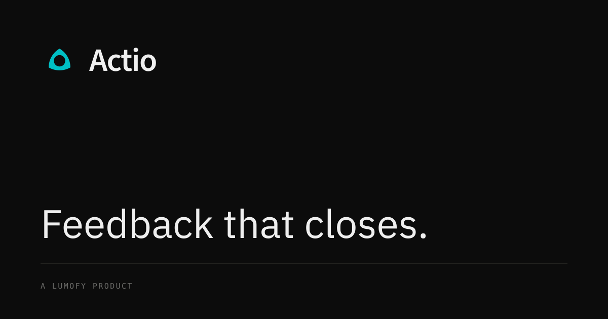
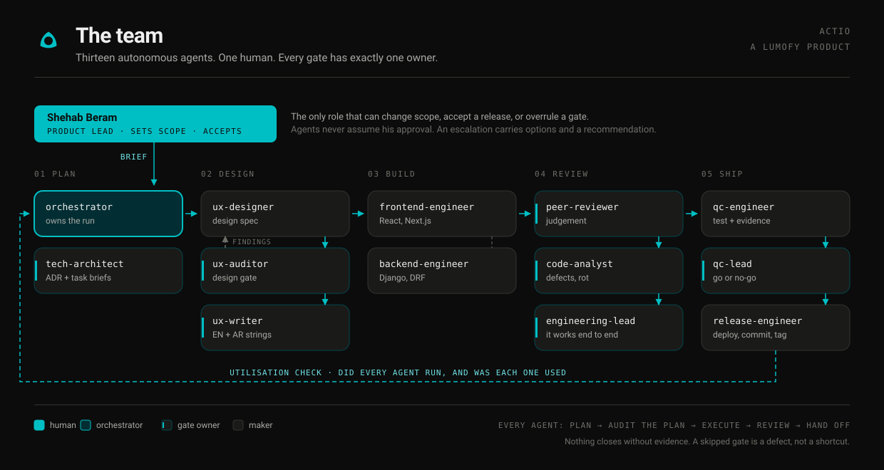
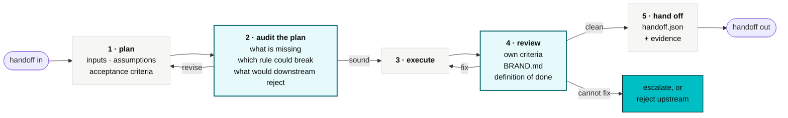

<div align="center">



# Actio

**The accountability layer for engagement and culture surveys.**

Actio routes employee feedback to whoever can actually fix it, and does not let it close without proof.

<p>


</p>

</div>

---

## Version 1

This is the specification. The product is being built against it and is not here yet.

Version 1 fixes the decisions that are expensive to change later: what the product does, who it is for, what it measures, and every rule the interface is built to. Nothing in here is provisional, so the first screen can be written against a decision rather than a preference.

**What lands next:** design tokens, the self-hosted type stack, then the component set. Watch or star the repo if you want the first release.

Version 1 also ships the team that builds it. See [the team](#the-team).

---

## The team

Actio is built by a swarm of fifteen autonomous agents under one human Product Lead.

<div align="center">

</div>

**Shehab Beram is the Product Lead.** He sets the brief and he is the only role that can
change scope, accept a release, or overrule a gate. Agents never assume his approval, and
an escalation reaches him as a decision with options and a recommendation, never as a bare
question.

| | Agent | Owns | Gate |
|---|---|---|---|
| **L1** | [`orchestrator`](./.claude/agents/orchestrator.md) | The run. Routing, gate enforcement, the utilisation check. | Run closure |
| | [`bug-historian`](./.claude/agents/bug-historian.md) | [`BUGS.md`](./BUGS.md), the standing rules, the regression brief | Regression guard |
| **L2** | [`tech-architect`](./.claude/agents/tech-architect.md) | Architecture of record, ADRs, task briefs for FE and BE | Design authority |
| | [`engineering-lead`](./.claude/agents/engineering-lead.md) | Integration. Does it actually work end to end. | Engineering |
| | [`qc-lead`](./.claude/agents/qc-lead.md) | Evidence audit, independent final pass, go or no-go | Quality |
| **L3** | [`ux-designer`](./.claude/agents/ux-designer.md) | Design specs for every surface | – |
| | [`ux-auditor`](./.claude/agents/ux-auditor.md) | Independent audit of design and shipped UI | Design |
| | [`ux-writer`](./.claude/agents/ux-writer.md) | Every string, English and Arabic | Copy |
| | [`frontend-engineer`](./.claude/agents/frontend-engineer.md) | React and Next.js implementation | – |
| | [`backend-engineer`](./.claude/agents/backend-engineer.md) | Supabase: schema, RLS, functions, Edge Functions | – |
| | [`peer-reviewer`](./.claude/agents/peer-reviewer.md) | Design judgement, boundaries, failure modes | Review, 1 of 3 |
| | [`code-analyst`](./.claude/agents/code-analyst.md) | Line-by-line defects, security, structural rot | Review, 2 of 3 |
| | [`code-steward`](./.claude/agents/code-steward.md) | Readability, naming, comments, maintainability | Review, 3 of 3 |
| | [`qc-engineer`](./.claude/agents/qc-engineer.md) | Testing APIs, code and product, with evidence | – |
| | [`release-engineer`](./.claude/agents/release-engineer.md) | Deploy, commit, tag, verify, roll back | Release |

### Every agent runs the same loop



Step 2 is the one that pays for itself. An agent that audits its own plan before executing
catches the missing state, the unchecked assumption and the brand rule it was about to
break, at the point where fixing it costs nothing.

### Six roles exist only to disagree

| Checker | Checks | Why it is separate |
|---|---|---|
| `ux-auditor` | `ux-designer` | The designer fixes, the auditor finds. A designer grading their own work is blind to exactly the failures an auditor is for. |
| `peer-reviewer` | The diff, for judgement | Is this the right solution, simply built. No linter answers that. |
| `code-analyst` | The diff, for facts | Line by line, so a plausible design does not carry a real bug past the others. |
| `code-steward` | The diff, for the next reader | Naming, shape, module headers, comments that say why. Correct code nobody can safely change is a cost that arrives later. |
| `bug-historian` | The diff, against history | Has a defect already recorded on this surface been committed again. The other three read the change on its own terms and cannot see a repeat. |
| `qc-lead` | `qc-engineer` | Audits whether the evidence exists and what was **not** tested. Untested surface is the finding this role exists to catch. |

And the orchestrator checks the checkers: after every stage it verifies that each agent
that should have run did run, and that each agent's output was actually consumed
downstream. An agent whose work nobody read is a utilisation failure, and it gets
reported rather than hidden.

### Skills

Each agent is coupled with the skills it needs. Fourteen house skills carry Actio's own
rules, and twenty-two vendored skills carry craft.

| Pack | Source | Used by |
|---|---|---|
| **House** (14) | `actio-agent-protocol`, `actio-orchestration`, `actio-brand-guard`, `actio-design-system`, `actio-ux-audit`, `actio-bilingual-copy`, `actio-architecture`, `actio-code-review`, `actio-code-analysis`, `actio-clean-code`, `actio-bug-register`, `actio-supabase`, `actio-test-protocol`, `actio-release` | All |
| **Taste** (13) | [Leonxlnx/taste-skill](https://github.com/Leonxlnx/taste-skill) | `ux-designer`, `ux-auditor` |
| **Vercel** (9) | [vercel-labs/agent-skills](https://github.com/vercel-labs/agent-skills) | `ux-designer`, `ux-auditor`, `ux-writer`, `frontend-engineer`, `release-engineer` |

### The platform

[`actio-design-system`](./.claude/skills/actio-design-system/SKILL.md) is built on seven
approved references in [`docs/design-reference/`](./docs/design-reference/).
`ref-02-ops-dashboard.png` is primary for **anatomy**, what an operations product is made
of. `ref-06-insights-panel.webp` is primary for **feel**, and where the two disagree on
surface treatment, `ref-06` wins. `ref-04-category-dashboard.png` is a **counter-example**,
kept in the set to be recognised and refused: a sentiment heatmap of tinted cells on a red
to green ramp, and a score per cohort presented as a thing to defend.

**The structure comes from the references. The surface comes from `BRAND.md`.** They define
look, feel and overall SaaS experience: anatomy, density, hierarchy and interaction. **They
never define colour.** Vega `#00BFC4` is the accent and `BRAND.md` is the only source for
it. Colour, gradient, motion and copy style are not adopted: the references run on a lime
accent with soft gradients, tinted callouts, multi-hue chart ramps and Title Case, all of
which Actio bans. The skill carries the full adopt, adapt and reject table. The rule it adds
that matters most is the **inversion rule**: one surface per view may go dark, and it
carries the one thing the reader came for. `ref-06` adds the **smoothness doctrine**:
surfaces separating by lightness and space rather than by outline, one type scale used
across its full range, chrome deleted before anything is styled, one motion curve with
nothing animating on load, and a vertical rhythm regular enough to predict.

Where a vendored skill and [`BRAND.md`](./BRAND.md) disagree, `BRAND.md` wins and the
override is recorded. Several taste skills optimise for premium, decorative aesthetics
that Actio bans outright, so they are used for compositional rigour and never for their
decorative vocabulary. The per-skill verdicts are in
[`actio-brand-guard`](./.claude/skills/actio-brand-guard/SKILL.md).

**Full detail:** [`docs/TEAM.md`](./docs/TEAM.md) for the org, the RACI and the escalation
ladder. [`docs/WORKFLOW.md`](./docs/WORKFLOW.md) for the delivery flow, the eleven gates and
the handoff schema. [`CLAUDE.md`](./CLAUDE.md) is the operating manual the agents load.

---

## What Actio does

When an employee tells their employer something is wrong, a named person fixes it and the employee is told what happened.

Organisations collect feedback well and act on it badly. Around two thirds of employees believe nothing happens after a survey. Participation falls, the data degrades, and each round is worth less than the last.

| | |
|---|---|
| **65%** | of employees say nothing happens after a survey |
| **41%** | actual response rate at 1,000 to 5,000 employees |
| **37%** | have seen change since the previous survey |

Actio classifies every issue by who has the authority to change it, assigns it to a named owner with a date, and holds it open until evidence of the change is attached.

Sold to operations as retention infrastructure, not to HR as a culture programme.

---

## Why routing is the product

A team lead cannot change pay bands, shift rotation or career structure. Sending those findings to that person guarantees they are not fixed, and teaches the workforce that answering is pointless.

| Today | With Actio |
|---|---|
| Survey | Survey |
| Dashboard | Route by authority |
| Deck | Named owner and date |
| Nothing | Evidence attached |
| | Employee told |

Actio separates what a manager can solve from what operations, leadership or a protected case channel must solve, and tracks each to closure separately.

| Lane | Owns |
|---|---|
| Team lead | Workload, one to ones |
| Operations | Rosters, staffing |
| Leadership | Pay, career, policy |
| Protected | Misconduct and safety, handled as a case outside the queue |

**Measured on** first-90-day attrition, closure rate, and median days to close. Not a sentiment score.

Built for high-attrition frontline operations in Southeast Asia. Works over WhatsApp, SMS and web, in Bahasa Indonesia, English and Tagalog, with Arabic inherited from Lumofy. The reader is usually on a phone, often in a second language, often mid-shift, and is deciding whether honesty carries a cost.

---

## What is in this repository

| Path | What it is |
|---|---|
| [`BRAND.md`](./BRAND.md) | The machine-readable spec. Tokens, type, contrast, component rules, copy rules. Read this first if you are building anything. |
| [`Actio-Brand-Guidelines-v1.pdf`](./Actio-Brand-Guidelines-v1.pdf) | The same rules for people, with the reasoning and the measured numbers behind each one. |
| [`CLAUDE.md`](./CLAUDE.md) | The operating manual every agent loads. What Actio is, the org, the flow, the hard rules. |
| [`BUGS.md`](./BUGS.md) | The defect register. Every bug found and every mistake an agent made, with the standing rule it produced. Owned by `bug-historian`. |
| [`.claude/agents/`](./.claude/agents/) | The fifteen agent definitions |
| [`.claude/skills/`](./.claude/skills/) | Fourteen house skills and twenty-two vendored ones |
| [`docs/`](./docs/) | The org, the delivery flow, the diagrams |
| [`.actio/`](./.actio/) | The run ledger. Plans, reviews, handoffs and evidence, per run. |
| [`logo/`](./logo/) | The seal and the lockups, in every colourway. See [`logo/README.md`](./logo/README.md) for which file to use where. |

```
actio/
├── README.md
├── CLAUDE.md                              operating manual, loaded every session
├── BUGS.md                                the defect register and standing rules
├── BRAND.md
├── Actio-Brand-Guidelines-v1.pdf
├── LICENSE
├── .claude/
│   ├── settings.json
│   ├── agents/                            15 agent definitions
│   └── skills/
│       ├── actio-*/                       14 house skills
│       └── <vendored>/                    22 from taste-skill and vercel-labs
├── .actio/
│   ├── TEMPLATE/                          plan.md · review.md · handoff.json
│   └── runs/                              one directory per run
├── docs/
│   ├── TEAM.md                            org chart, RACI, escalation
│   ├── WORKFLOW.md                        delivery flow, gates, handoff schema
│   └── diagrams/actio-team.svg
└── logo/
    ├── README.md
    ├── svg/
    │   ├── mark/          seal-{vega,cosmos,white,halo,currentcolor}.svg
    │   ├── horizontal/    actio-horizontal-{six colourways}.svg
    │   ├── wordmark/      actio-wordmark-{four}.svg
    │   ├── tagline/       lockup with "Feedback that closes."
    │   ├── bilingual/     Latin and Arabic, signage and certificates
    │   └── guides/        clear-space overlay for third parties
    └── social/            og-image-1200x630.svg
```

Vertical, Arabic, parent and descriptor lockups, the raster and app-icon exports and the print PDFs are named in [`logo/README.md`](./logo/README.md) and have not been exported yet.

---

## Roadmap

| # | Step | State |
|---|---|---|
| 1 | Specification: `BRAND.md`, the guidelines, the marks | Done |
| 2 | The team: 15 agents, 14 house skills, the run ledger, the defect register | Done |
| 3 | Tokens as CSS custom properties, Tailwind config and native resources | Next |
| 4 | Source Sans 3, IBM Plex Sans, Mono and Sans Arabic self-hosted as WOFF2 | Next |
| 5 | Contrast check running in continuous integration | Next |
| 6 | Components: button, input, select, status pill, card, table row, empty state, toast, modal, nav shell | Not started |
| 7 | Channels: WhatsApp utility templates, employee update, manager assignment email, SMS fallback | Not started |
| 8 | Dark mode and all four locales verified on a real handset | Not started |

`BRAND.md` and the guidelines PDF are versioned together. A change to one without the other is a defect.

---

## Licence and trademark

Proprietary. See [LICENSE](./LICENSE).

Third parties may use the horizontal lockup unmodified, with correct clear space, to state that their product integrates with Lumofy Actio, and where a mark is reproduced the accompanying text reads: *Actio and the Actio seal are marks of Lumofy.* Use of the seal alone, incorporation of the name into another product name or domain, modification of any mark, and application to merchandise are not permitted.

<div align="center">
<br>

<br><br>
<sub><b>Actio</b>, a product of <a href="https://lumofy.com">Lumofy</a>. Built by <a href="https://www.shehabberam.com/">Shehab Beram</a>.</sub>
</div>
