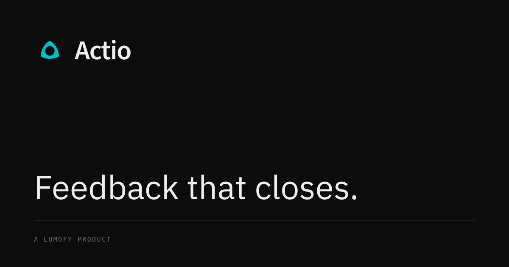
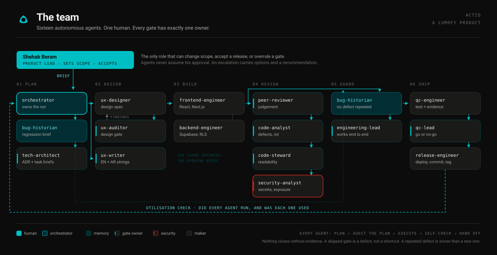
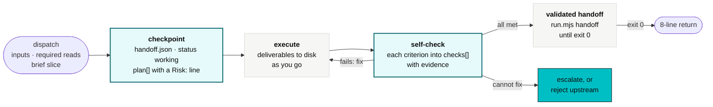

<div align="center">



# Actio

**The accountability layer for engagement and culture surveys.**

Actio routes employee feedback to whoever can actually fix it, and does not let it close without proof.

<p>


</p>

</div>

---

## Version 1

This is the specification. The product is being built against it, and it lands in `web/`, `extension/` and `supabase/` run by run.

Version 1 fixes the decisions that are expensive to change later: what the product does, who it is for, what it measures, and every rule the interface is built to. Nothing in here is provisional, so the first screen can be written against a decision rather than a preference.

**What lands next:** design tokens, the self-hosted type stack, then the component set. Watch or star the repo if you want the first release.

Version 1 also ships the team that builds it. See [the team](#the-team).

---

## The team

Actio is built by a swarm of sixteen autonomous agents under one human Product Lead.

<div align="center">

</div>

<div align="center">

</div>

One run in one picture: the stages left to right, the five checks of stage 5 in parallel, the
loop inside every agent, and the four lanes. The two-minute walkthrough is
[How a run moves](./docs/WORKFLOW.md#how-a-run-moves).

**Shehab Beram is the Product Lead.** He sets the brief and he is the only role that can
change scope, accept a release, or overrule a gate. Agents never assume his approval, and
an escalation reaches him as a decision with options and a recommendation, never as a bare
question.

| | Agent | Owns | Gate |
|---|---|---|---|
| **L1** | [`orchestrator`](./.claude/agents/orchestrator.md) | The run. Routing, gate enforcement, the utilisation check. | Run closure |
| | [`bug-historian`](./.claude/agents/bug-historian.md) | [`BUGS.md`](./BUGS.md), the standing rules, the regression brief | Regression guard |
| **L2** | [`tech-architect`](./.claude/agents/tech-architect.md) | Architecture of record, ADRs, task briefs for FE and BE | Design authority |
| | [`engineering-lead`](./.claude/agents/engineering-lead.md) | Integration. Does it actually work end to end. | Engineering |
| | [`qc-lead`](./.claude/agents/qc-lead.md) | Evidence audit, independent final pass, go or no-go | Quality |
| **L3** | [`ux-designer`](./.claude/agents/ux-designer.md) | Design specs for every surface | – |
| | [`ux-auditor`](./.claude/agents/ux-auditor.md) | Independent audit of design and shipped UI | Design |
| | [`ux-writer`](./.claude/agents/ux-writer.md) | Every string, English and Arabic | Copy |
| | [`frontend-engineer`](./.claude/agents/frontend-engineer.md) | React and Next.js implementation in `web/`, and the Chrome extension in `extension/` | – |
| | [`backend-engineer`](./.claude/agents/backend-engineer.md) | Supabase: schema, RLS, functions, Edge Functions | – |
| | [`peer-reviewer`](./.claude/agents/peer-reviewer.md) | Design judgement, boundaries, failure modes | Review, 1 of 3 |
| | [`code-analyst`](./.claude/agents/code-analyst.md) | Line-by-line defects, security, structural rot | Review, 2 of 3 |
| | [`code-steward`](./.claude/agents/code-steward.md) | Readability, naming, comments, maintainability | Review, 3 of 3 |
| | [`security-analyst`](./.claude/agents/security-analyst.md) | Secrets, exposure, authorisation, injection, dependencies, robustness | Security |
| | [`qc-engineer`](./.claude/agents/qc-engineer.md) | Testing APIs, code and product, with evidence | – |
| | [`release-engineer`](./.claude/agents/release-engineer.md) | Release to the Supabase project, commit, tag, push, verify, roll back | Release |

### Every agent runs the same loop


```mermaid
flowchart LR
  IN(["dispatch<br/>inputs · required reads<br/>brief slice"]) --> CP
  CP["<b>checkpoint</b><br/>handoff.json · status working<br/>plan[] with a Risk: line"]:::audit
  EX["<b>execute</b><br/>deliverables to disk<br/>as you go"]:::step
  SC["<b>self-check</b><br/>each criterion into checks[]<br/>with evidence"]:::audit
  HO["<b>validated handoff</b><br/>run.mjs handoff<br/>until exit 0"]:::step
  RET(["8-line return"])
  ESC["escalate, or<br/>reject upstream"]:::esc
  CP --> EX
  EX --> SC
  SC -- "fails: fix" --> EX
  SC -- "cannot fix" --> ESC
  SC -- "all met" --> HO
  HO -- "exit 0" --> RET
  classDef step fill:#F6F6F4,stroke:#D8D8D4,color:#0C0C0C
  classDef audit fill:#E6FAFB,stroke:#02646B,stroke-width:2px,color:#0C0C0C
  classDef esc fill:#00BFC4,stroke:#0C0C0C,color:#0C0C0C
```

The checkpoint is the step that pays for itself. An agent that writes down its plan, and a
`Risk:` line for each question in its own pre-mortem, catches the missing state, the
unchecked assumption and the brand rule it was about to break, at the point where fixing it
costs nothing. It is also what survives a cut-off: a resumed agent continues from its own
`working` handoff. One `handoff.json` carries the plan, the checks and the findings, so
there is no `plan.md` and no `review.md`.

### Seven roles exist only to disagree

| Checker | Checks | Why it is separate |
|---|---|---|
| `ux-auditor` | `ux-designer` | The designer fixes, the auditor finds. A designer grading their own work is blind to exactly the failures an auditor is for. |
| `peer-reviewer` | The diff, for judgement | Is this the right solution, simply built. No linter answers that. |
| `code-analyst` | The diff, for facts | Line by line, so a plausible design does not carry a real bug past the others. |
| `code-steward` | The diff, for the next reader | Naming, shape, module headers, comments that say why. Correct code nobody can safely change is a cost that arrives later. |
| `security-analyst` | The diff, for what can be broken into | Exposure, authorisation and supply chain. A leak here costs the product its claim, not a password reset. |
| `bug-historian` | The diff, against history | Has a defect already recorded on this surface been committed again. The other four read the change on its own terms and cannot see a repeat. A script, run beside the reviews, so it costs no wait. |
| `qc-lead` | `qc-engineer` | Audits whether the evidence exists and what was **not** tested. Untested surface is the finding this role exists to catch. |

And the orchestrator checks the checkers: after every stage it verifies that each agent
that should have run did run, and that each agent's output was actually consumed
downstream. An agent whose work nobody read is a utilisation failure, and it gets
reported rather than hidden.

### Skills

Fifteen house skills carry Actio's own rules, and the vendored skills carry craft. An agent
preloads `actio-agent-protocol` and its role's core house skills; every vendored skill is
read on demand, by path, when its trigger fires, and is never preloaded.

| Pack | Source | Used by |
|---|---|---|
| **House** (15) | `actio-agent-protocol`, `actio-orchestration`, `actio-brand-guard`, `actio-design-system`, `actio-ux-audit`, `actio-bilingual-copy`, `actio-architecture`, `actio-code-review`, `actio-code-analysis`, `actio-clean-code`, `actio-bug-register`, `actio-security`, `actio-supabase`, `actio-test-protocol`, `actio-release` | All load the protocol; each role its core skills |
| **Taste** (13) | [Leonxlnx/taste-skill](https://github.com/Leonxlnx/taste-skill) | `ux-designer`, `ux-auditor` |
| **Supabase** (2) | [supabase/agent-skills](https://github.com/supabase/agent-skills) | `backend-engineer`, `security-analyst` |
| **Vercel** (9) | [vercel-labs/agent-skills](https://github.com/vercel-labs/agent-skills) | `ux-designer`, `ux-auditor`, `ux-writer`, `frontend-engineer`. `deploy-to-vercel`, `vercel-cli-with-tokens` and `vercel-optimize` are coupled to no agent: reference only, for when a deploy target is chosen. |

### The platform

[`actio-design-system`](./.claude/skills/actio-design-system/SKILL.md) is built on seven
approved references in [`docs/design-reference/`](./docs/design-reference/).
`ref-06-insights-panel.webp` is **the primary reference**, for anatomy as well as feel.
`ref-02-ops-dashboard.png` is supporting, and its six-tile metric row and filled sidebar are
explicitly not adopted. **Where the two disagree on anything, `ref-06` wins**, with one
written exception: the issue queue is deliberately denser. `ref-04-category-dashboard.png` is a **counter-example**,
kept in the set to be recognised and refused: a sentiment heatmap of tinted cells on a red
to green ramp, and a score per cohort presented as a thing to defend.

**The structure comes from the references. The surface comes from `BRAND.md`.** They define
look, feel and overall SaaS experience: anatomy, density, hierarchy and interaction. **They
never define colour.** Vega `#00BFC4` is the accent and `BRAND.md` is the only source for
it. Colour, gradient, motion and copy style are not adopted: the references run on a lime
accent with soft gradients, tinted callouts, multi-hue chart ramps and Title Case, all of
which Actio bans. The skill carries the full adopt, adapt and reject table. The rule it adds
that matters most is the **inversion rule**: one surface per view may go dark, and it
carries the one thing the reader came for. `ref-06` adds the **smoothness doctrine**:
surfaces separating by lightness and space rather than by outline, one type scale used
across its full range, chrome deleted before anything is styled, one motion curve with
nothing animating on load, and a vertical rhythm regular enough to predict.

Where a vendored skill and [`BRAND.md`](./BRAND.md) disagree, `BRAND.md` wins and the
override is recorded. Several taste skills optimise for premium, decorative aesthetics
that Actio bans outright, so they are used for compositional rigour and never for their
decorative vocabulary. The per-skill verdicts are in
[`actio-brand-guard`](./.claude/skills/actio-brand-guard/SKILL.md).

**Full detail:** [`docs/TEAM.md`](./docs/TEAM.md) for the org, the models, the RACI and the
escalation ladder. [`docs/WORKFLOW.md`](./docs/WORKFLOW.md) for the two-minute walkthrough,
the delivery flow, the lanes, the twelve gates and the run artefacts. The handoff schema is
in [`actio-agent-protocol`](./.claude/skills/actio-agent-protocol/SKILL.md).
[`CLAUDE.md`](./CLAUDE.md) is the operating manual the agents load.

**Running the swarm:** start the orchestrator as the main thread with
`claude --agent orchestrator` and give it the brief. It opens the run with
`node .actio/bin/run.mjs open`, picks the lane, and is the only role that dispatches, so
every stage lands in the ledger (a hook writes the `dispatched` and `returned` rows) and
the utilisation check can see it.

### Toolchain

Present on the machine: git, node 24, npm, npx, the Supabase MCP server (`supabase` in
`.mcp.json`, scoped to one project) and the Playwright MCP server (`playwright` in
`.mcp.json`, carried by qc-engineer and qc-lead). Nothing else may be assumed. The full
statement, including what the swarm does not depend on and what a missing tool means, is in
[`CLAUDE.md`](./CLAUDE.md#toolchain).

Database work goes through the Supabase MCP, from migration files in the repo, and is
iterated offline with `npm run db:test`, which runs the migrations, the seed and the pgTAP
tests on PGlite with no Docker. The workflow is in
[`actio-supabase`](./.claude/skills/actio-supabase/SKILL.md). Hosting deployment is out of
scope until Shehab chooses a target, and is recorded as `deferred: no target chosen`.

Browser testing uses Playwright two ways: the committed `@playwright/test` suite, `npm run e2e`
in `web/` and in `extension/`, for every regression check and every piece of gate evidence, and the Playwright
MCP for exploratory testing, reproduction and live capture. The doctrine is in
[`actio-test-protocol`](./.claude/skills/actio-test-protocol/SKILL.md).

`run.mjs open` runs the scriptable pre-flight at the start of every run: node and npm answer,
and the Playwright line of `claude mcp list` is logged. The orchestrator adds one Supabase
`list_tables` call. If the Supabase MCP does not answer, it escalates to Shehab before any
database stage runs, and he authorises it with `/mcp`; the stages that do not need it still
run. If the Playwright MCP does not, it tells Shehab and every stage still runs, because gate
evidence comes from the suite. `verify.mjs` runs the build, lint, typecheck, test and
`db:test` steps once per tree, and the QA and release roles reuse the bundle.

---

## What Actio does

When an employee tells their employer something is wrong, a named person fixes it and the employee is told what happened.

Organisations collect feedback well and act on it badly. Around two thirds of employees believe nothing happens after a survey. Participation falls, the data degrades, and each round is worth less than the last.

| | |
|---|---|
| **65%** | of employees say nothing happens after a survey |
| **41%** | actual response rate at 1,000 to 5,000 employees |
| **37%** | have seen change since the previous survey |

Actio classifies every issue by who has the authority to change it, assigns it to a named owner with a date, and holds it open until evidence of the change is attached.

Sold to operations as retention infrastructure, not to HR as a culture programme.

---

## Why routing is the product

A team lead cannot change pay bands, shift rotation or career structure. Sending those findings to that person guarantees they are not fixed, and teaches the workforce that answering is pointless.

| Today | With Actio |
|---|---|
| Survey | Survey |
| Dashboard | Route by authority |
| Deck | Named owner and date |
| Nothing | Evidence attached |
| | Employee told |

Actio separates what a manager can solve from what operations, leadership or a protected case channel must solve, and tracks each to closure separately.

| Lane | Owns |
|---|---|
| Team lead | Workload, one to ones |
| Operations | Rosters, staffing |
| Leadership | Pay, career, policy |
| Protected | Misconduct and safety, handled as a case outside the queue |

**Measured on** first-90-day attrition, closure rate, and median days to close. Not a sentiment score.

Built for high-attrition frontline operations in Southeast Asia. Works over WhatsApp, SMS and web, in Bahasa Indonesia, English and Tagalog, with Arabic inherited from Lumofy. The reader is usually on a phone, often in a second language, often mid-shift, and is deciding whether honesty carries a cost.

---

## What is in this repository

| Path | What it is |
|---|---|
| [`BRAND.md`](./BRAND.md) | The machine-readable spec. Tokens, type, contrast, component rules, copy rules. Read this first if you are building anything. |
| [`Actio-Brand-Guidelines-v1.pdf`](./Actio-Brand-Guidelines-v1.pdf) | The same rules for people, with the reasoning and the measured numbers behind each one. |
| [`CLAUDE.md`](./CLAUDE.md) | The operating manual every agent loads. What Actio is, the org, the flow, the hard rules. |
| [`BUGS.md`](./BUGS.md) | The defect register. Every bug found and every mistake an agent made, with the standing rule it produced. Owned by `bug-historian`. |
| [`.claude/agents/`](./.claude/agents/) | The sixteen agent definitions |
| [`.claude/skills/`](./.claude/skills/) | Fifteen house skills and twenty-two vendored ones |
| [`docs/`](./docs/) | The org, the delivery flow, the diagrams |
| [`.actio/`](./.actio/) | The run ledger and the node scripts: handoffs and evidence per run, `run.mjs`, the ledger hook, `verify.mjs`, `bugs.mjs` and the utilisation check. |
| `web/` | The Next.js App Router app, TypeScript, npm. Lands as runs land. |
| `extension/` | The Chrome extension: Manifest V3, React and TypeScript, built with Vite, for the desktop roles only. Owned by frontend-engineer (ADR-0003). |
| `supabase/` | The database source of record: migrations, pgTAP tests, seed and Edge Functions. Lands as runs land. |
| `package.json` | Private, npm workspaces `["web", "extension"]`, dev tooling. `npm run db:test` runs the offline database proof. |
| `.mcp.json` | The Supabase MCP server, scoped to one project |
| [`logo/`](./logo/) | The seal and the lockups, in every colourway. See [`logo/README.md`](./logo/README.md) for which file to use where. |

```
actio/
├── README.md
├── CLAUDE.md                              operating manual, loaded every session
├── BUGS.md                                the defect register and standing rules
├── BRAND.md
├── Actio-Brand-Guidelines-v1.pdf
├── LICENSE
├── package.json                           npm workspaces ["web", "extension"], db:test
├── .mcp.json                              the Supabase MCP server
├── .claude/
│   ├── settings.json
│   ├── agents/                            16 agent definitions
│   └── skills/
│       ├── actio-*/                       15 house skills
│       └── <vendored>/                    22 from taste-skill and vercel-labs
├── .actio/
│   ├── bin/                               run · ledger-hook · verify · bugs · utilisation-check · sync-gates · db-test
│   ├── bugs/                              surfaces.json · history/
│   ├── TEMPLATE/                          handoff.json · lanes/
│   └── runs/                              one directory per run
├── web/                                   Next.js App Router app, TypeScript, npm
├── extension/                             Manifest V3 Chrome extension, React, TypeScript, Vite
├── supabase/
│   ├── migrations/                        <yyyymmddhhmmss>_<slug>.sql, the source of record
│   ├── tests/                             *.test.sql, pgTAP
│   ├── functions/                         <name>/index.ts, Edge Functions
│   └── seed.sql
├── content/strings/                       en.json · ar.json, the shipped string catalogue
├── design/surfaces/                       canonical design specs, one per surface
├── docs/
│   ├── TEAM.md                            org chart, RACI, escalation
│   ├── WORKFLOW.md                        how a run moves, flow, lanes, gates, run artefacts
│   └── diagrams/                          actio-team.svg · actio-run-v2.svg
└── logo/
    ├── README.md
    ├── svg/
    │   ├── mark/          seal-{vega,cosmos,white,halo,currentcolor}.svg
    │   ├── horizontal/    actio-horizontal-{six colourways}.svg
    │   ├── wordmark/      actio-wordmark-{four}.svg
    │   ├── tagline/       lockup with "Feedback that closes."
    │   ├── bilingual/     Latin and Arabic, signage and certificates
    │   └── guides/        clear-space overlay for third parties
    └── social/            og-image-1200x630.svg
```

Vertical, Arabic, parent and descriptor lockups, the raster and app-icon exports and the print PDFs are named in [`logo/README.md`](./logo/README.md) and have not been exported yet.

---

## Roadmap

| # | Step | State |
|---|---|---|
| 1 | Specification: `BRAND.md`, the guidelines, the marks | Done |
| 2 | The team: 16 agents, 15 house skills, the run ledger, the defect register | Done |
| 3 | Tokens as CSS custom properties, Tailwind config and native resources | Next |
| 4 | Source Sans 3, IBM Plex Sans, Mono and Sans Arabic self-hosted as WOFF2 | Next |
| 5 | Contrast check running in continuous integration | Next |
| 6 | Components: button, input, select, status pill, card, table row, empty state, toast, modal, nav shell | Not started |
| 7 | Channels: WhatsApp utility templates, employee update, manager assignment email, SMS fallback | Not started |
| 8 | Dark mode and all four locales verified on a real handset | Not started |

`BRAND.md` and the guidelines PDF are versioned together. A change to one without the other is a defect.

---

## Licence and trademark

Proprietary. See [LICENSE](./LICENSE).

Third parties may use the horizontal lockup unmodified, with correct clear space, to state that their product integrates with Lumofy Actio, and where a mark is reproduced the accompanying text reads: *Actio and the Actio seal are marks of Lumofy.* Use of the seal alone, incorporation of the name into another product name or domain, modification of any mark, and application to merchandise are not permitted.

<div align="center">
<br>

<br><br>
<sub><b>Actio</b>, a product of <a href="https://lumofy.com">Lumofy</a>. Built by <a href="https://www.shehabberam.com/">Shehab Beram</a>.</sub>
</div>
