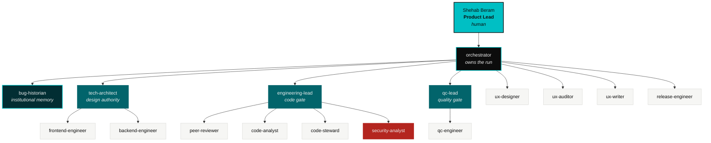
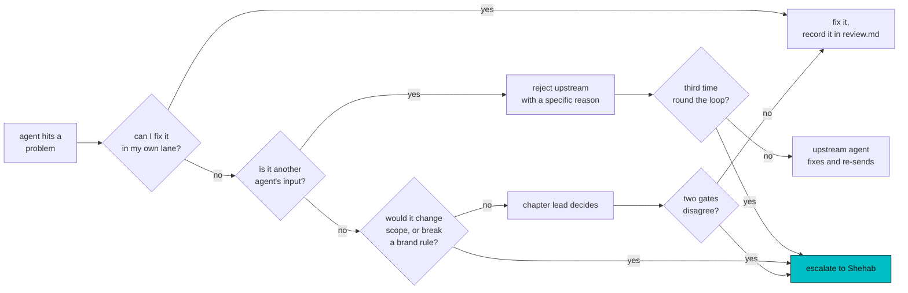

# The team

Actio is built by a swarm of autonomous agents under one human Product Lead. This file is
the org: who reports to whom, who owns what, who can block, and who decides.

The delivery flow and the gates are in [`WORKFLOW.md`](./WORKFLOW.md). The agent
definitions themselves are in [`../.claude/agents/`](../.claude/agents/).

---

## Org chart

Solid lines are reporting, not routing. Work routes along the delivery flow, which is a
different shape and lives in [`WORKFLOW.md`](./WORKFLOW.md).

---

## The roster

### L0 · Product Lead

**Shehab Beram.** Human. Sets the brief. The only role that can change scope, accept a
release, or overrule a gate. Agents never assume his approval; when a decision is his, the
agent stops and states the decision needed, the options, and its recommendation.

### L1 · Orchestrator

| | |
|---|---|
| **Agent** | [`orchestrator`](../.claude/agents/orchestrator.md) |
| **Owns** | The run, end to end |
| **Gate** | Run closure |
| **Skills** | `actio-agent-protocol`, `actio-orchestration`, `actio-brand-guard` |

Opens every run with the toolchain pre-flight (node, npm and the Supabase MCP answer, or
Shehab is told before any database stage runs), decomposes a brief into a run plan,
dispatches agents, enforces gates, maintains the ledger, and runs the **utilisation check**: did every agent that should have run actually
run, and was every agent that ran actually used. An agent whose output nobody consumed is a
utilisation failure and gets reported, not hidden. Does not design, code, review or test.

### L2 · Chapter leads

| Agent | Owns | Gate | Skills |
|---|---|---|---|
| [`tech-architect`](../.claude/agents/tech-architect.md) | Architecture of record, ADRs, task briefs | Design authority | `actio-architecture`, `actio-brand-guard` |
| [`engineering-lead`](../.claude/agents/engineering-lead.md) | Integration. Does it work end to end. | Engineering gate | `actio-code-review`, `actio-architecture` |
| [`qc-lead`](../.claude/agents/qc-lead.md) | Evidence audit, final independent pass | Quality gate | `actio-test-protocol` |

### L3 · Makers and checkers

**Design chapter**

| Agent | Owns | Gate | Skills beyond the protocol |
|---|---|---|---|
| [`ux-designer`](../.claude/agents/ux-designer.md) | Design specs for every surface | – | `actio-design-system`, `actio-brand-guard`, `taste-skill`, `minimalist-skill`, `brandkit`, `output-skill`, `web-design-guidelines`, `composition-patterns` |
| [`ux-auditor`](../.claude/agents/ux-auditor.md) | Independent audit of design and shipped UI | Design gate | `actio-design-system`, `actio-ux-audit`, `actio-brand-guard`, `redesign-skill`, `web-design-guidelines`, `taste-skill` |
| [`ux-writer`](../.claude/agents/ux-writer.md) | Every string, English and Arabic | Copy gate | `actio-bilingual-copy`, `actio-brand-guard`, `writing-guidelines` |

**Engineering chapter**

| Agent | Owns | Gate | Skills beyond the protocol |
|---|---|---|---|
| [`frontend-engineer`](../.claude/agents/frontend-engineer.md) | React and Next.js implementation | – | `actio-design-system`, `actio-brand-guard`, `react-best-practices`, `composition-patterns`, `react-view-transitions`, `web-design-guidelines` |
| [`backend-engineer`](../.claude/agents/backend-engineer.md) | Supabase: schema, RLS, functions, Edge Functions | – | `actio-supabase`, `supabase`, `supabase-postgres-best-practices` |
| [`peer-reviewer`](../.claude/agents/peer-reviewer.md) | Design judgement, boundaries, failure modes | Review gate, 1 of 3 | `actio-code-review` |
| [`code-analyst`](../.claude/agents/code-analyst.md) | Line-by-line defects, security, structural rot | Review gate, 2 of 3 | `actio-code-analysis` |
| [`code-steward`](../.claude/agents/code-steward.md) | Readability, naming, comments, maintainability | Review gate, 3 of 3 | `actio-clean-code`, `actio-architecture`, `actio-supabase` |
| [`security-analyst`](../.claude/agents/security-analyst.md) | Secrets, exposure, authorisation, injection, dependencies, robustness | Security | `actio-security`, `actio-supabase`, `supabase-postgres-best-practices`, `actio-architecture` |

**Memory**

| Agent | Owns | Gate | Skills beyond the protocol |
|---|---|---|---|
| [`bug-historian`](../.claude/agents/bug-historian.md) | [`BUGS.md`](../BUGS.md), the standing rules, the regression brief | Regression guard | `actio-bug-register`, `actio-architecture` |

`bug-historian` bookends every run. It opens by briefing every agent on what has already
broken on the surfaces this change touches, and it closes by recording what broke this
time and the standing rule that follows. Its gate in the middle is where the brief is
enforced rather than merely published. It is the only agent that writes to `BUGS.md`.

**Quality and release**

| Agent | Owns | Gate | Skills beyond the protocol |
|---|---|---|---|
| [`qc-engineer`](../.claude/agents/qc-engineer.md) | Testing APIs, code and product, with evidence | – | `actio-test-protocol`, `actio-brand-guard`, `actio-design-system` |
| [`release-engineer`](../.claude/agents/release-engineer.md) | Release to the Supabase project, commit, tag, push, verify, roll back | Release gate | `actio-release` |

`deploy-to-vercel`, `vercel-cli-with-tokens` and `vercel-optimize` stay in the repository but
are coupled to no agent: reference only, for when a deploy target is chosen. Until then
`release-engineer` releases the back end to the Supabase project through the MCP, tags and
pushes, and records front-end hosting as `deferred: no target chosen`.

### Tools

Present on the machine: git, node 24, npm, npx, and the Supabase MCP server (`supabase` in
`.mcp.json`, scoped to one project). Nothing else may be assumed. The swarm does not depend
on Docker, the Supabase CLI, Deno, the Vercel CLI, pnpm, psql, jq or python. The full
statement is in [`CLAUDE.md`](../CLAUDE.md#toolchain).

An agent that touches the database carries `mcp__supabase` in the `tools` line of its
frontmatter and works through [`actio-supabase`](../.claude/skills/actio-supabase/SKILL.md).
`orchestrator` carries `mcp__supabase__list_tables` alone, for the toolchain pre-flight at run
open, and never applies, queries or changes the database. An agent whose tool does not answer
hands off `blocked` and says why. It never fakes the result.

---

## Why the checkers are separate from the makers

Seven roles exist only to disagree with another role, and each is deliberately independent
of the one it checks.

| Checker | Checks | Why it is separate |
|---|---|---|
| `ux-auditor` | `ux-designer` | The designer fixes, the auditor finds. Merging them means the designer grades their own work, and the failure modes a designer is blind to are exactly the ones an auditor is for. |
| `peer-reviewer` | The diff, for judgement | Reads for whether this is the right solution, simply built. Answers a question no linter can. |
| `code-analyst` | The diff, for facts | Reads line by line for defects and rot. Runs independently of `peer-reviewer` so that a plausible design does not carry a real bug past both. |
| `code-steward` | The diff, for the next reader | Reads for naming, shape, module headers and comments that say why. Correct code nobody can safely change is a cost that arrives later, and no other role is looking for it. |
| `security-analyst` | The diff, for what can be broken into | Reads for exposure, authorisation and supply chain. The other reviewers read for whether the code is right; this one reads for whether it can be taken. A leak here costs the product its claim, not a password reset. |
| `bug-historian` | The diff, against history | Reads for whether a defect already recorded on this surface has been committed again. The other four read the change on its own terms and cannot see a repeat. |
| `qc-lead` | `qc-engineer` | Audits whether the evidence exists and what was **not** tested. Untested surface is the finding this role exists to catch. |

All three review gates must pass, and so must the security gate and the regression guard. `engineering-lead`
refuses to proceed if any did not run, and treats that as a utilisation failure rather than
an oversight.

The three reviewers and the security-analyst run in parallel and none sees another's
verdict first, so no reviewer anchors on another's conclusion.

---

## RACI by stage

**R** responsible · **A** accountable · **C** consulted · **I** informed

| Stage | Shehab | orc | bh | arch | uxd | uxa | uxw | fe | be | pr | ca | cs | sec | engl | qce | qcl | rel |
|---|---|---|---|---|---|---|---|---|---|---|---|---|---|---|---|---|---|
| Brief | **A/R** | C | C | C | I | I | I | I | I | I | I | I | I | I | I | I | I 
| Run plan | A | **R** | C | C | I | I | I | I | I | I | I | I | I | C | I | C | I 
| Architecture | I | A | C | **R** | C | I | I | C | C | I | I | I | I | C | I | I | I 
| Design | I | A | C | C | **R** | **R** | C | C | I | I | I | I | I | I | I | I | I 
| Copy | I | A | C | I | C | C | **R** | C | C | I | I | I | I | I | I | I | I 
| Build | I | A | C | C | C | I | C | **R** | **R** | I | I | I | I | C | I | I | I 
| Review | I | A | **R** | C | I | I | I | C | C | **R** | **R** | **R** | **R** | C | I | I | I 
| Integration | I | A | C | C | I | I | I | C | C | C | C | C | C | **R** | I | C | I 
| Test | I | A | C | I | I | C | I | C | C | I | I | I | I | C | **R** | C | I 
| Release readiness | **A** | C | C | I | I | I | I | I | I | I | I | C | I | C | C | **R** | C 
| Release | A | C | I | I | I | I | I | I | I | I | I | I | I | I | I | C | **R** 
| Run closure | I | **R/A** | C | I | I | I | I | I | I | I | I | I | I | I | I | I | I 
| Acceptance | **A/R** | C | I | I | I | I | I | I | I | I | I | I | I | I | I | I | I 

---

## Who can block

| Role | Can block | Overturned by |
|---|---|---|
| `ux-auditor` | The design gate | `ux-designer` fixing it, or Shehab |
| `peer-reviewer` | Review gate 1 of 3 | The author fixing it, or Shehab |
| `code-analyst` | Review gate 2 of 3 | The author fixing it, or Shehab |
| `code-steward` | Review gate 3 of 3 | The author fixing it, or Shehab |
| `security-analyst` | The security gate. A critical or high blocks outright. | Shehab only, in writing, recorded in BUGS.md |
| `bug-historian` | The regression guard, when a known defect has been repeated | The author fixing it, or Shehab |
| `engineering-lead` | Anything reaching QC | Shehab |
| `qc-lead` | The release outright | Shehab only, and the override is recorded in the ledger |
| `release-engineer` | Its own release, on a failed pre-flight | Shehab |
| `orchestrator` | Any stage whose upstream gate has not passed | Shehab |

No agent relaxes a gate to hit a date. It escalates instead.

---

## Escalation ladder

An escalation to Shehab always carries three things: the decision needed, the options with
their consequences, and the agent's recommendation. Never a bare question.

---

## The utilisation check

The Product Lead asked for an orchestrator that verifies the swarm is actually being used,
not merely that it exists. After every stage, `orchestrator` runs this against the run plan.

| Failure | Detection |
|---|---|
| Agent never ran | No `handoff.json` at the expected path |
| Agent ran but produced nothing | `produced` is empty, or the listed paths are absent on disk |
| Agent's output nobody consumed | No later handoff lists this agent's outputs in `consumed` |
| Gate skipped | A stage started while its upstream gate is unresolved |
| Gate self-certified | The gate's `result` was written by an agent that does not own that gate |
| Rejection loop | The same reject between the same two agents three times |
| Idle agent | Work queued for an agent that has no handoff and no blocker |

Any one of these blocks the run. The orchestrator reports the finding as a table and routes
the fix. It never marks a gate pass on another agent's behalf.

---

## Autonomy

Every agent runs its own five-step loop without asking permission: plan, audit the plan,
execute, review, hand off. They ask only for decisions that are genuinely the Product
Lead's, and they never assume his approval.

The full loop, the run artefact layout and the handoff schema are in
[`../.claude/skills/actio-agent-protocol/SKILL.md`](../.claude/skills/actio-agent-protocol/SKILL.md).
