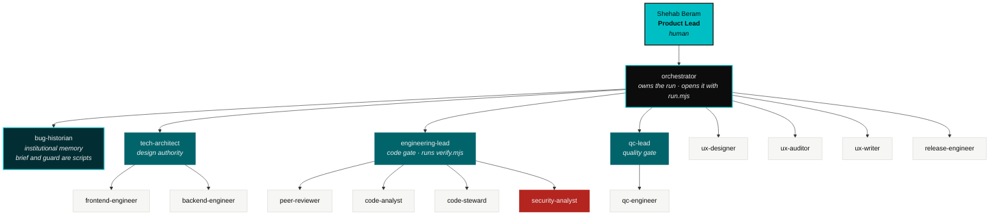
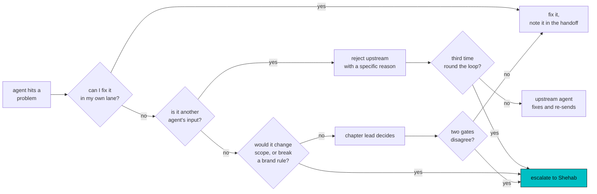

# The team

Actio is built by a swarm of autonomous agents under one human Product Lead. This file is
the org: who reports to whom, who owns what, who can block, and who decides.

The delivery flow, the lanes and the gates are in [`WORKFLOW.md`](./WORKFLOW.md). The agent
definitions themselves are in [`../.claude/agents/`](../.claude/agents/).

---

## Org chart

```mermaid
flowchart TD
  SHEHAB["Shehab Beram<br/><b>Product Lead</b><br/><i>human</i>"]:::human

  ORC["orchestrator<br/><i>owns the run · opens it with run.mjs</i>"]:::lead
  BH["bug-historian<br/><i>institutional memory<br/>brief and guard are scripts</i>"]:::mem

  ARCH["tech-architect<br/><i>design authority</i>"]:::l2
  ENGL["engineering-lead<br/><i>code gate · runs verify.mjs</i>"]:::l2
  QCL["qc-lead<br/><i>quality gate</i>"]:::l2

  UXD["ux-designer"]:::design
  UXA["ux-auditor"]:::design
  UXW["ux-writer"]:::design

  FE["frontend-engineer"]:::eng
  BE["backend-engineer"]:::eng
  PR["peer-reviewer"]:::eng
  CA["code-analyst"]:::eng
  CS["code-steward"]:::eng
  SEC["security-analyst"]:::sec

  QCE["qc-engineer"]:::qc
  REL["release-engineer"]:::rel

  SHEHAB --> ORC
  ORC --> BH
  ORC --> ARCH
  ORC --> ENGL
  ORC --> QCL
  ORC --> UXD
  ORC --> UXA
  ORC --> UXW
  ORC --> REL

  ARCH --> FE
  ARCH --> BE
  ENGL --> PR
  ENGL --> CA
  ENGL --> CS
  ENGL --> SEC
  QCL --> QCE

  classDef human fill:#00BFC4,stroke:#0C0C0C,stroke-width:2px,color:#0C0C0C
  classDef lead fill:#0C0C0C,stroke:#00BFC4,stroke-width:2px,color:#EFEFEF
  classDef mem fill:#022E33,stroke:#00BFC4,stroke-width:2px,color:#EFEFEF
  classDef sec fill:#B4251F,stroke:#B4251F,color:#EFEFEF
  classDef l2 fill:#02646B,stroke:#02646B,color:#EFEFEF
  classDef design fill:#F6F6F4,stroke:#D8D8D4,color:#0C0C0C
  classDef eng fill:#F6F6F4,stroke:#D8D8D4,color:#0C0C0C
  classDef qc fill:#F6F6F4,stroke:#D8D8D4,color:#0C0C0C
  classDef rel fill:#F6F6F4,stroke:#D8D8D4,color:#0C0C0C
```

Solid lines are reporting, not routing. Work routes along the delivery flow, which is a
different shape and lives in [`WORKFLOW.md`](./WORKFLOW.md).

---

## The roster

Model and effort come from each agent's frontmatter. The orchestrator can override the model
for one plan entry with the entry's `model` field. Every agent also has a `maxTurns` limit
as a runaway guard; an agent that hits it is resumed by the orchestrator, not re-run. An
agent preloads `actio-agent-protocol` and the core skill or skills listed here. Everything
else, the vendored packs included, is read on demand by path, with its trigger named in the
agent file, and `actio-brand-guard` overrides a vendored skill wherever it disagrees with
[`BRAND.md`](../BRAND.md).

### L0 · Product Lead

**Shehab Beram.** Human. Sets the brief. The only role that can change scope, accept a
release, or overrule a gate. Agents never assume his approval; when a decision is his, the
agent stops and states the decision needed, the options, and its recommendation.

### L1 · Orchestrator

| | |
|---|---|
| **Agent** | [`orchestrator`](../.claude/agents/orchestrator.md) |
| **Owns** | The run, end to end |
| **Gate** | Run closure |
| **Model, effort** | `opus`, medium. The main thread of the session, so it has no turn limit |
| **Preloaded skills** | `actio-agent-protocol`, `actio-orchestration`. `actio-brand-guard` is read on demand |

Opens every run with `run.mjs open`, which creates the run from a lane template and runs the
scriptable toolchain pre-flight (node, npm, the Playwright line of `claude mcp list`). It adds
one Supabase `list_tables` call, so Shehab is told before any stage that needs a missing
tool runs. It decomposes the brief into a run plan, dispatches agents, enforces gates,
maintains the ledger, and runs the **utilisation check**: did every agent that should have
run actually run, and was every agent that ran actually used. An agent whose output nobody
consumed is a utilisation finding and gets reported, not hidden. Does not design, code,
review or test.

### L2 · Chapter leads

| Agent | Owns | Gate | Model | Effort | Preloaded skills |
|---|---|---|---|---|---|
| [`tech-architect`](../.claude/agents/tech-architect.md) | Architecture of record, ADRs, task briefs | Design authority | `opus` | high | `actio-architecture` |
| [`engineering-lead`](../.claude/agents/engineering-lead.md) | Integration. Does it work end to end. Runs `verify.mjs` once per tree | Engineering gate | `opus` | medium | the protocol only |
| [`qc-lead`](../.claude/agents/qc-lead.md) | Evidence audit, final independent pass | Quality gate | `opus` | medium | `actio-test-protocol` |

### L3 · Makers and checkers

**Design chapter**

| Agent | Owns | Gate | Model | Effort | Preloaded skills |
|---|---|---|---|---|---|
| [`ux-designer`](../.claude/agents/ux-designer.md) | Design specs and string slots for every surface | – | `opus` | medium | `actio-design-system`, `actio-brand-guard` |
| [`ux-auditor`](../.claude/agents/ux-auditor.md) | Independent audit of design and shipped UI | Design gate | `opus` | medium | `actio-ux-audit`, `actio-brand-guard` |
| [`ux-writer`](../.claude/agents/ux-writer.md) | Every string, English and Arabic | Copy gate | `opus` | medium | `actio-bilingual-copy` |

**Engineering chapter**

| Agent | Owns | Gate | Model | Effort | Preloaded skills |
|---|---|---|---|---|---|
| [`frontend-engineer`](../.claude/agents/frontend-engineer.md) | React and Next.js implementation in `web/`, and the Chrome extension in `extension/` | – | `opus` | medium | `actio-design-system` |
| [`backend-engineer`](../.claude/agents/backend-engineer.md) | Supabase: schema, RLS, functions, Edge Functions | – | `opus` | high | `actio-supabase` |
| [`peer-reviewer`](../.claude/agents/peer-reviewer.md) | Design judgement, boundaries, failure modes | Review gate, 1 of 3 | `opus` | medium | `actio-code-review` |
| [`code-analyst`](../.claude/agents/code-analyst.md) | Line-by-line defects, security, structural rot | Review gate, 2 of 3 | `opus` | medium | `actio-code-analysis` |
| [`code-steward`](../.claude/agents/code-steward.md) | Readability, naming, comments, maintainability | Review gate, 3 of 3 | `sonnet` | medium | `actio-clean-code` |
| [`security-analyst`](../.claude/agents/security-analyst.md) | Secrets, exposure, authorisation, injection, dependencies, robustness | Security | `opus` | high | `actio-security` |

**Memory**

| Agent | Owns | Gate | Model | Effort | Preloaded skills |
|---|---|---|---|---|---|
| [`bug-historian`](../.claude/agents/bug-historian.md) | [`BUGS.md`](../BUGS.md), the standing rules, the regression brief | Regression guard | `sonnet` | medium | `actio-bug-register` |

`bug-historian` bookends every run. It opens by briefing every agent on what has already
broken on the surfaces this change touches, and it closes by recording the product-code
defects found this time and the standing rule that follows. The brief (`bugs.mjs brief`) and the guard
(`bugs.mjs guard`) are scripts it runs and then judges, so it does not read the whole
register. Its gate in the middle is where the brief is enforced rather than merely
published. It is the only agent that writes to `BUGS.md`.

**Quality and release**

| Agent | Owns | Gate | Model | Effort | Preloaded skills |
|---|---|---|---|---|---|
| [`qc-engineer`](../.claude/agents/qc-engineer.md) | Testing APIs, code and product, with evidence | – | `sonnet` | high | `actio-test-protocol` |
| [`release-engineer`](../.claude/agents/release-engineer.md) | Release to the Supabase project, commit, tag, push, verify, roll back | Release gate | `opus` | medium | `actio-release` |

`release-engineer` is `opus` because its actions cannot be undone. `deploy-to-vercel`,
`vercel-cli-with-tokens` and `vercel-optimize` stay in the repository but are coupled to no
agent: reference only, for when a deploy target is chosen. Until then `release-engineer`
releases the back end to the Supabase project through the MCP, tags and pushes, and records
front-end hosting as `deferred: no target chosen`.

### Tools

Present on the machine: git, node 24, npm, npx, the Supabase MCP server (`supabase` in
`.mcp.json`, scoped to one project) and the Playwright MCP server (`playwright` in
`.mcp.json`, carried by qc-engineer and qc-lead). Nothing else may be assumed. The full
statement, including what the swarm does not depend on, is in
[`CLAUDE.md`](../CLAUDE.md#toolchain).

An agent that touches the database carries `mcp__supabase` in the `tools` line of its
frontmatter and works through [`actio-supabase`](../.claude/skills/actio-supabase/SKILL.md).
`orchestrator` carries `mcp__supabase__list_tables` alone, for the toolchain pre-flight at run
open, and never applies, queries or changes the database. `qc-engineer` and `qc-lead` carry
`mcp__playwright`, for exploratory testing, reproducing a reported defect and live capture;
their gate evidence comes from the committed suite, as
[`actio-test-protocol`](../.claude/skills/actio-test-protocol/SKILL.md) sets out. An agent
whose tool does not answer hands off `blocked` and says why. It never fakes the result.

---

## Why the checkers are separate from the makers

Seven roles exist only to disagree with another role, and each is deliberately independent
of the one it checks.

| Checker | Checks | Why it is separate |
|---|---|---|
| `ux-auditor` | `ux-designer` | The designer fixes, the auditor finds. Merging them means the designer grades their own work, and the failure modes a designer is blind to are exactly the ones an auditor is for. |
| `peer-reviewer` | The diff, for judgement | Reads for whether this is the right solution, simply built. Answers a question no linter can. |
| `code-analyst` | The diff, for facts | Reads line by line for defects and rot. Runs independently of `peer-reviewer` so that a plausible design does not carry a real bug past both. |
| `code-steward` | The diff, for the next reader | Reads for naming, shape, module headers and comments that say why. Correct code nobody can safely change is a cost that arrives later, and no other role is looking for it. |
| `security-analyst` | The diff, for what can be broken into | Reads for exposure, authorisation and supply chain. The other reviewers read for whether the code is right; this one reads for whether it can be taken. A leak here costs the product its claim, not a password reset. |
| `bug-historian` | The diff, against history | Reads for whether a defect already recorded on this surface has been committed again. The other four read the change on its own terms and cannot see a repeat. Runs as a script on the same snapshot, so it costs no wait. |
| `qc-lead` | `qc-engineer` | Audits whether the evidence exists and what was **not** tested. Untested surface is the finding this role exists to catch. |

All three review gates must pass, and so must the security gate and the regression guard.
`engineering-lead` refuses to proceed if any did not run, or if one judged an older
snapshot than the latest maker's (`GATE_STALE`), and treats that as a utilisation finding
rather than an oversight.

The three reviewers, the security-analyst and the guard run in parallel and none sees
another's verdict first, so no reviewer anchors on another's conclusion. After a fix, each
owner re-reads the delta, not the whole change.

---

## RACI by stage

**R** responsible · **A** accountable · **C** consulted · **I** informed. Stage numbers match
the flow in [`WORKFLOW.md`](./WORKFLOW.md).

| Stage | Shehab | orc | bh | arch | uxd | uxa | uxw | fe | be | pr | ca | cs | sec | engl | qce | qcl | rel |
|---|---|---|---|---|---|---|---|---|---|---|---|---|---|---|---|---|---|
| Brief | **A/R** | C | C | C | I | I | I | I | I | I | I | I | I | I | I | I | I |
| Run plan and lane | A | **R** | C | C | I | I | I | I | I | I | I | I | I | C | I | C | I |
| 1 Regression brief | I | A | **R** | C | I | I | I | I | I | I | I | I | I | I | I | I | I |
| 1 Architecture | I | A | C | **R** | C | I | I | C | C | I | I | I | I | C | I | I | I |
| 2 to 3 Design | I | A | C | C | **R** | **R** | C | C | I | I | I | I | I | I | I | I | I |
| 3 Copy | I | A | C | I | C | C | **R** | C | C | I | I | I | I | I | I | I | I |
| 2 and 4 Build | I | A | C | C | C | I | C | **R** | **R** | I | I | I | I | C | I | I | I |
| 5 Review and guard | I | A | **R** | C | I | I | I | C | C | **R** | **R** | **R** | **R** | C | I | I | I |
| 6 Integration | I | A | C | C | I | I | I | C | C | C | C | C | C | **R** | I | C | I |
| 7 Test | I | A | C | I | I | C | I | C | C | I | I | I | I | C | **R** | C | I |
| 8 Release readiness | **A** | C | C | I | I | I | I | I | I | I | I | C | I | C | C | **R** | C |
| 9 Release | A | C | I | I | I | I | I | I | I | I | I | I | I | I | I | C | **R** |
| 10 Record | I | A | **R** | I | I | I | I | I | I | I | I | I | I | I | C | C | I |
| Run closure | I | **R/A** | C | I | I | I | I | I | I | I | I | I | I | I | I | I | I |
| Acceptance | **A/R** | C | I | I | I | I | I | I | I | I | I | I | I | I | I | I | I |

A lane removes the rows it does not touch. The removal is a recorded planning decision in
`out_of_scope`, never a silent omission.

---

## Who can block

| Role | Can block | Overturned by |
|---|---|---|
| `ux-auditor` | The design gate | `ux-designer` fixing it, or Shehab |
| `peer-reviewer` | Review gate 1 of 3 | The author fixing it, or Shehab |
| `code-analyst` | Review gate 2 of 3 | The author fixing it, or Shehab |
| `code-steward` | Review gate 3 of 3 | The author fixing it, or Shehab |
| `security-analyst` | The security gate. A critical or high blocks outright. | Shehab only, in writing, recorded in BUGS.md |
| `bug-historian` | The regression guard, when a known defect has been repeated | The author fixing it, or Shehab |
| `engineering-lead` | Anything reaching QC | Shehab |
| `qc-lead` | The release outright | Shehab only, and the override is recorded in the ledger |
| `release-engineer` | Its own release, on a failed pre-flight | Shehab |
| `orchestrator` | Any stage whose upstream gate is unresolved, meaning not `pass` and not `n/a` with a written reason | Shehab |

Only a `blocker` or a `major` finding blocks. A `minor` or a `nit` is fixed in the same pass
or marked `accepted`, and never rejects a handoff. No agent relaxes a gate to hit a date. It
escalates instead.

---

## Escalation ladder

```mermaid
flowchart LR
  A["agent hits a<br/>problem"] --> B{"can I fix it<br/>in my own lane?"}
  B -- yes --> C["fix it,<br/>note it in the handoff"]
  B -- no --> D{"is it another<br/>agent's input?"}
  D -- yes --> E["reject upstream<br/>with a specific reason"]
  E --> F{"third time<br/>round the loop?"}
  F -- no --> G["upstream agent<br/>fixes and re-sends"]
  F -- yes --> H["escalate to Shehab"]
  D -- no --> I{"would it change<br/>scope, or break<br/>a brand rule?"}
  I -- yes --> H
  I -- no --> J["chapter lead decides"]
  J --> K{"two gates<br/>disagree?"}
  K -- yes --> H
  K -- no --> C

  classDef esc fill:#00BFC4,stroke:#0C0C0C,color:#0C0C0C
  class H esc
```

An escalation to Shehab always carries three things: the decision needed, the options with
their consequences, and the agent's recommendation. Never a bare question. In a handoff it
is a `decisions_for_shehab` entry.

---

## The utilisation check

The Product Lead asked for an orchestrator that verifies the swarm is actually being used,
not merely that it exists. `run.mjs next` runs it after every stage, in compact form, and
`run.mjs close` runs it once more at closure. The full code table, with what to do for each,
is in [`actio-orchestration`](../.claude/skills/actio-orchestration/SKILL.md).

| Failure | Code | Class | Detection |
|---|---|---|---|
| Agent never ran | `NEVER_RAN` | blocking | No handoff for a plan entry the run has moved past |
| Agent ran but produced nothing | `PHANTOM_OUTPUT` | blocking | A `produced` path is missing or empty |
| Gate skipped | `GATE_SKIPPED` | blocking | A stage ran while a gate it depends on was unresolved |
| Gate self-certified | `GATE_SELF_CERTIFIED` | blocking | A gate result written by an agent that does not own that gate |
| Gate stale | `GATE_STALE` | blocking | A code gate judged an older snapshot than the latest maker's |
| Output nobody consumed | `UNUSED_OUTPUT` | advisory | No later handoff cites a planned output |
| Rejection loop | `REJECTION_LOOP` | judged | The same reject between the same two agents three times |
| Idle agent | `IDLE_AGENT` | judged | Work due for an agent that has no dispatch and no recorded reason |

Also blocking: `MALFORMED_HANDOFF`, `GATE_UNRESOLVED`, `UNKNOWN_GATE`. Also advisory:
`FALSE_CONSUMPTION`, `LOOP_SKIPPED`, `NO_TIMING`. The orchestrator judges `STALLED`,
`REJECTION_LOOP`, `IDLE_AGENT` and `ORPHAN_EVIDENCE` itself, from the ledger and the tree.

A blocking finding stops the run, and the orchestrator reports it as a table and routes the
fix. An advisory finding goes into the run report in plain words and never on its own
justifies a dispatch. It never marks a gate pass on another agent's behalf.

---

## Autonomy

Every agent runs its own loop without asking permission: read the dispatch, checkpoint a
`working` handoff with a plan and a `Risk:` line, execute, self-check against its acceptance
criteria, hand off a validated `handoff.json`, and return in at most eight lines. They ask
only for decisions that are genuinely the Product Lead's, and they never assume his approval.

The loop, the handoff schema and the evidence rules are in
[`../.claude/skills/actio-agent-protocol/SKILL.md`](../.claude/skills/actio-agent-protocol/SKILL.md).
The run artefact layout is in [`WORKFLOW.md`](./WORKFLOW.md#run-artefacts).
