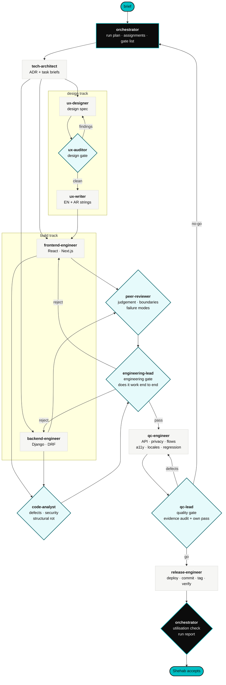
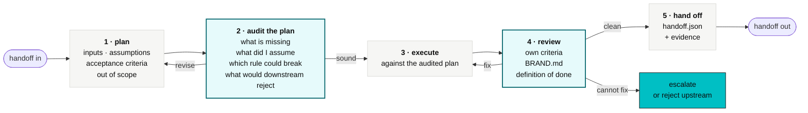
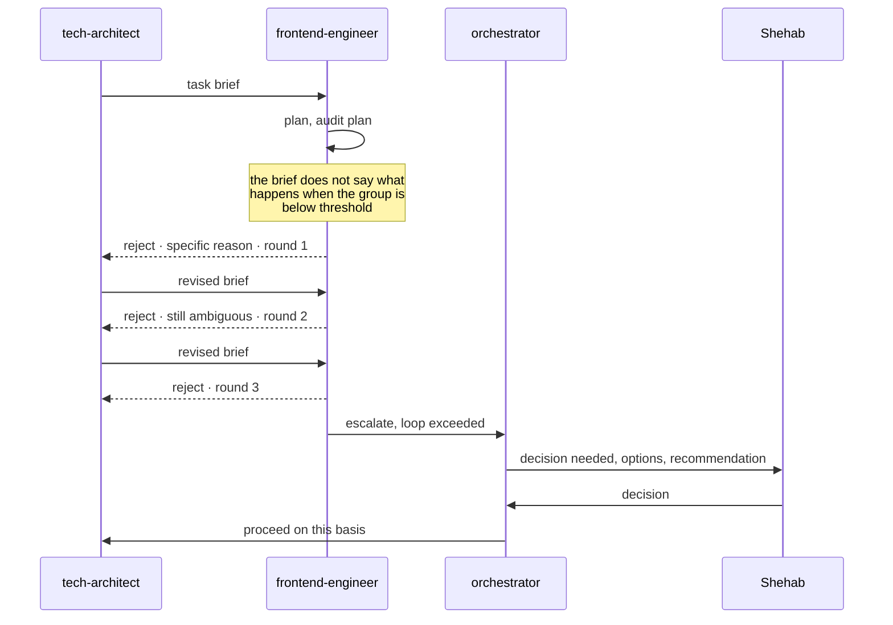

# How the swarm works

How a change moves from a brief to a release, which gates stand between them, and what
every agent does inside its own turn.

The org is in [`TEAM.md`](./TEAM.md). The agents are in
[`../.claude/agents/`](../.claude/agents/).

---

## The delivery flow



The design track and the build track run in parallel. They converge at the front end,
which needs both the design spec and the string catalogue before it can be finished.

---

## The five-step loop, inside every agent

Each box above expands into the same loop. No agent skips a step, and the audit step runs
**before** execution, not after.



| Step | What it produces | Where |
|---|---|---|
| 1 Plan | The plan | `.actio/runs/<run-id>/<agent>/plan.md` |
| 2 Audit | The revision log, appended to the plan | same file |
| 3 Execute | The work itself | wherever the work lives |
| 4 Review | The self-review | `.actio/runs/<run-id>/<agent>/review.md` |
| 5 Hand off | The handoff record | `.actio/runs/<run-id>/<agent>/handoff.json` |

Step 2 is the one that is usually skipped and the one that pays for itself. An agent that
audits its own plan before executing catches the missing state, the unchecked assumption
and the brand rule it was about to break, at the point where fixing it costs nothing.

---

## The gates

| # | Gate | Owner | Passes when |
|---|---|---|---|
| 1 | Design authority | `tech-architect` | The ADR is written, the task briefs are unambiguous, and the change does not erode a system boundary |
| 2 | Design | `ux-auditor` | No blocker or major findings remain, every state is covered, accessibility is measured not estimated, and the layout survives the longest locale |
| 3 | Copy | `ux-writer` | Every string exists in English and Arabic, passes the competitor check, and no string concatenates a count |
| 4 | Review, 1 of 2 | `peer-reviewer` | The change solves the brief's problem, sits in the right layer, and its failure modes are handled |
| 5 | Review, 2 of 2 | `code-analyst` | No defect above the severity threshold, no security finding, no complexity breach |
| 6 | Engineering | `engineering-lead` | Both reviews ran and passed, it builds, it migrates, the suite is green, and the feature works end to end with evidence attached |
| 7 | Quality | `qc-lead` | The evidence exists and shows what the log claims, the untested surface is named, and the product's own claims still hold |
| 8 | Release | `release-engineer` | Pre-flight clean, go from `qc-lead`, rollback plan written before deploy, post-deploy smoke passed |
| 9 | Run closure | `orchestrator` | Every agent in the plan ran, was used, and resolved its gates |

A stage does not start until its upstream gate reads pass. The orchestrator is the role
that catches a skipped gate, and a skipped gate is a defect rather than a shortcut.

---

## Rejection

A downstream agent that receives bad input sends it back. It does not paper over it.



Three rounds is the limit. On the third, the loop escalates rather than continuing, because
a loop that has not converged in three rounds is a disagreement, not a misunderstanding.

---

## Run artefacts

The filesystem is the swarm's shared memory. Every run is inspectable after the fact
without reading a transcript.

```
.actio/runs/2026-09-20-privacy-preview/
├── run.json                      the plan: agents, order, gates, definition of done
├── ledger.md                     append-only event log, one line per event
├── orchestrator/
│   ├── plan.md
│   ├── review.md
│   └── handoff.json
├── tech-architect/
│   ├── plan.md
│   ├── adr-004-reporting-threshold.md
│   ├── brief-frontend.md
│   ├── brief-backend.md
│   ├── review.md
│   └── handoff.json
├── ux-designer/ ...
├── ux-auditor/
│   ├── findings.md
│   └── handoff.json
├── ...
└── evidence/
    ├── api-contract.log
    ├── privacy-invariants.log
    ├── queue-360px-ar.png
    └── lighthouse.json
```

Run id is `<yyyy-mm-dd>-<short-slug>`. Timestamps come from the shell, never invented.

---

## The handoff record

One file per agent per run. The orchestrator parses these, so the key names are fixed.

```json
{
  "run": "2026-09-20-privacy-preview",
  "agent": "ux-auditor",
  "status": "passed",
  "started": "2026-09-20T09:14:02Z",
  "finished": "2026-09-20T09:41:55Z",
  "consumed": [
    ".actio/runs/2026-09-20-privacy-preview/ux-designer/spec.md",
    ".actio/runs/2026-09-20-privacy-preview/ux-designer/handoff.json"
  ],
  "produced": [
    ".actio/runs/2026-09-20-privacy-preview/ux-auditor/findings.md",
    ".actio/runs/2026-09-20-privacy-preview/evidence/contrast-privacy-preview.json"
  ],
  "gates": [
    {
      "name": "design",
      "result": "pass",
      "evidence": ".actio/runs/2026-09-20-privacy-preview/ux-auditor/findings.md"
    }
  ],
  "blockers": [],
  "decisions_for_shehab": [],
  "next": "ux-writer"
}
```

| Field | Meaning |
|---|---|
| `status` | `passed`, `blocked`, `rejected`, `escalated` |
| `consumed` | What this agent read. This is how the orchestrator proves an upstream agent was actually used. |
| `produced` | What it wrote. Every path must exist on disk. |
| `gates` | Only gates this agent owns. Certifying someone else's gate is a defect. |
| `blockers` | What stopped it, why, and which agent or Shehab it needs |
| `decisions_for_shehab` | Question, options, recommendation. Never a bare question. |
| `next` | The agent that should run next, `shehab`, or `null` at run closure |

---

## Starting a run

Invoke `orchestrator` with the brief. It writes the run plan, dispatches, and reports back.

```
Use the orchestrator agent. Brief: add the privacy preview screen ahead of the
first response in a cycle. It must show the real group size, the reporting
threshold, the fields a manager can filter by, and what happens to free text.
```

For a small, self-contained change you can go straight to the responsible agent, but the
orchestrator still records the run and runs the utilisation check at the end. Skipping it
means nobody is checking that the gates held.
