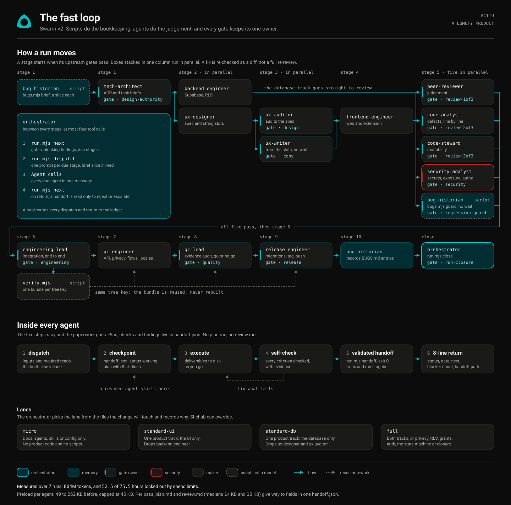
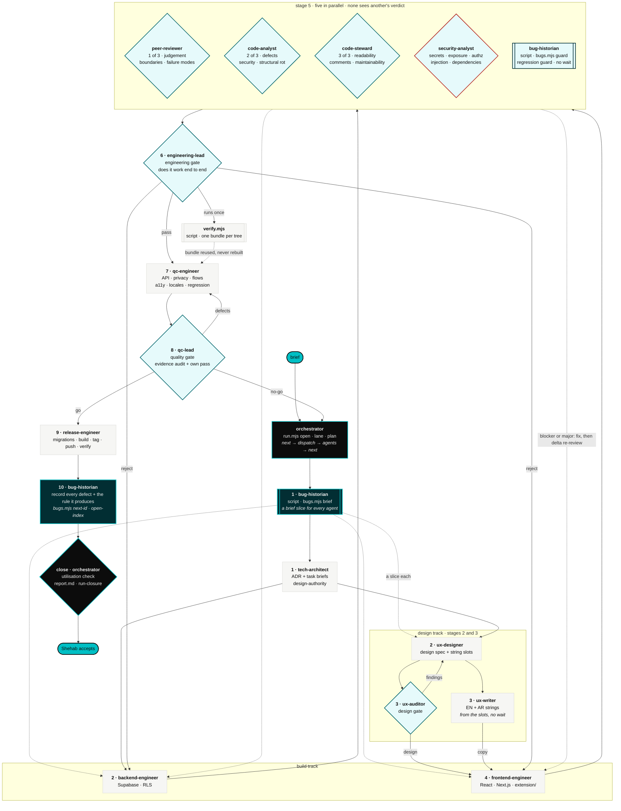
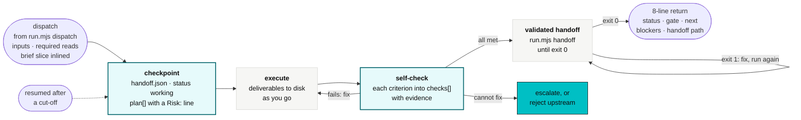
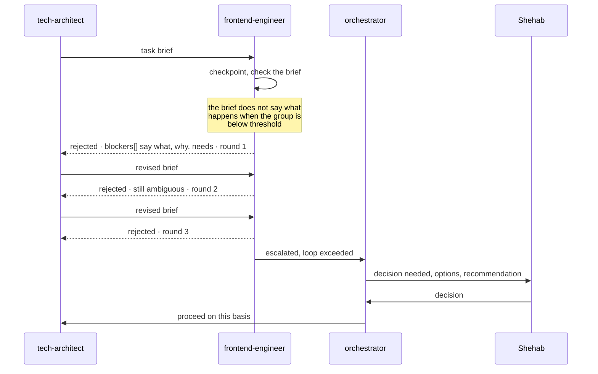

# How the swarm works

How a change moves from a brief to a release, which gates stand between them, and what
every agent does inside its own turn.

The org is in [`TEAM.md`](./TEAM.md). The agents are in
[`../.claude/agents/`](../.claude/agents/). The loop, the handoff schema and the toolchain
are in [`actio-agent-protocol`](../.claude/skills/actio-agent-protocol/SKILL.md). Run
planning, lanes and the utilisation check are in
[`actio-orchestration`](../.claude/skills/actio-orchestration/SKILL.md).

---

## How a run moves

This section is the two-minute read. Everything below it is the detail.

<div align="center">

</div>

A brief from Shehab becomes a run. The orchestrator opens it with `run.mjs open`, picks a
lane, and then repeats one routine until the run closes: ask the script what is due,
dispatch every due stage in one message, wait, ask again. Agents work in parallel wherever
the gates allow. **Scripts do the bookkeeping** (the regression brief and guard, the verify
bundle, the ledger). **Agents do the judgement.** Every gate keeps its name and its one
owner.

What v2 changes:

- **One file per pass.** The plan, the self-check, the findings, the gates, and what the
  agent consumed and produced are fields of one `handoff.json`. There is no `plan.md` and
  no `review.md`.
- **The brief is a script.** `bugs.mjs brief` picks the register entries for the surfaces
  the change touches and writes a slice for each agent, so nobody reads the whole register.
- **Nothing waits that need not.** The regression guard is a script and runs beside the four
  reviews. `ux-writer` runs beside `ux-auditor`, from the string slots.
- **A fix is re-checked as a diff.** Reviewers re-read `git diff <old> <new>` and their open
  findings, never the whole change again. Only a blocker or a major finding rejects.
- **Build once.** `verify.mjs` runs lint, typecheck, test, build and `db:test` once per
  tree, and qc-engineer, qc-lead and release-engineer reuse the bundle.
- **A lane drops what a change does not touch.** A docs change does not wake the design
  track.

### What it was costing, and what v2 sets

| | Before, measured over 7 runs | v2 sets |
|---|---|---|
| Spend | 804M tokens. 52.5 of 75.5 hours locked out by spend limits | No target number. The first v2 run is the baseline |
| Preload per dispatch | 49 to 262 KB (agent body plus its skills), and a 19 KB `CLAUDE.md` | At most 45 KB per agent, and `CLAUDE.md` at most 9 KB |
| Agent body | 11 to 36 KB | At most 8 KB |
| Protocol skill | 17.9 KB, preloaded by all 16 agents | At most 6 KB |
| Paperwork per pass | `plan.md` median 14 KB, `review.md` median 10 KB, handoff mean 12.5 KB | One `handoff.json`: soft 4 KB, hard 12 KB |
| Regression brief | Hand-written, up to 55 KB, from three full reads of a 114 KB register | `bugs.mjs brief`: at most 60 lines in all, at most 20 lines per agent |
| Orchestrator context | Peaked at 947k tokens, with 10 to 60 KB reports relayed through it | Four tool calls per boundary, an 8-line return per agent, handoff fields rather than artefacts |
| Waiting | The guard waited for the reviews, `ux-writer` for the design gate | Both run in parallel |

The left column is measured. The right column is what the design sets as a cap or a
mechanism. None of it is measured yet, and the first v2 run is the test.

### The lanes

The orchestrator picks the lane from the files the change will touch, writes the reason in
`lane_reason`, and Shehab can override it. A lane is a pre-written version of one rule:
delete the stages this change does not touch, and record each in `out_of_scope`.

| Lane | When | Plan |
|---|---|---|
| `micro` | No file under `web/`, `extension/`, `supabase/` or `.actio/bin/`, no `package*.json`: docs, agent definitions, skills, config | brief → the maker for the surface (`tech-architect` by default) → `peer-reviewer` ∥ `security-analyst` ∥ guard → `release-engineer` (commit and push, migrations n/a) → record |
| `standard-ui` | `web/` or `extension/`, nothing under `supabase/` | Every role but `backend-engineer` |
| `standard-db` | `supabase/`, nothing under `web/` or `extension/` | Every role but `ux-designer`, `ux-auditor` and `frontend-engineer`. `ux-writer` runs beside `backend-engineer` when a user-visible string changes |
| `full` | Both tracks, or anything touching the privacy invariants, RLS, grants, auth, the issue state machine or evidence closure | All 16 roles |

`micro` keeps `security-analyst` only when `.claude/settings.json`, `.mcp.json`, an agent's
`tools:` line, permissions, hooks or secrets are touched. A gate whose owner is not in the
plan is absent from `run.json` and named in `out_of_scope`, so a dropped gate is a recorded
decision, never a silent one. The lane templates are `.actio/TEMPLATE/lanes/<lane>.json`.

---

## The delivery flow

Stage numbers match the table in `actio-orchestration`. A double-edged box is a script, not
a model pass. Boxes in one stage run in parallel.


```mermaid
flowchart TD
  BRIEF(["brief"]):::human --> ORC

  ORC["<b>orchestrator</b><br/>run.mjs open · lane · plan<br/><i>next → dispatch → agents → next</i>"]:::orc --> BH

  BH[["<b>1 · bug-historian</b><br/>script · bugs.mjs brief<br/><i>a brief slice for every agent</i>"]]:::mem
  BH --> ARCH
  ARCH["<b>1 · tech-architect</b><br/>ADR + task briefs<br/>design-authority"]:::make

  BH -. "a slice each" .-> UXD
  BH -. " " .-> BE
  BH -. " " .-> FE

  ARCH --> UXD
  ARCH --> BE

  subgraph DESIGN ["design track · stages 2 and 3"]
    direction TB
    UXD["<b>2 · ux-designer</b><br/>design spec + string slots"]:::make
    UXA{"<b>3 · ux-auditor</b><br/>design gate"}:::gate
    UXW["<b>3 · ux-writer</b><br/>EN + AR strings<br/><i>from the slots, no wait</i>"]:::make
    UXD --> UXA
    UXD --> UXW
    UXA -- "findings" --> UXD
  end

  subgraph BUILD ["build track"]
    direction TB
    BE["<b>2 · backend-engineer</b><br/>Supabase · RLS"]:::make
    FE["<b>4 · frontend-engineer</b><br/>React · Next.js · extension/"]:::make
  end

  UXA -- "design" --> FE
  UXW -- "copy" --> FE

  subgraph REVIEW ["stage 5 · five in parallel · none sees another's verdict"]
    direction TB
    PR{"<b>peer-reviewer</b><br/>1 of 3 · judgement<br/>boundaries · failure modes"}:::gate
    CA{"<b>code-analyst</b><br/>2 of 3 · defects<br/>security · structural rot"}:::gate
    CS{"<b>code-steward</b><br/>3 of 3 · readability<br/>comments · maintainability"}:::gate
    SEC{"<b>security-analyst</b><br/>secrets · exposure · authz<br/>injection · dependencies"}:::sec
    RG[["<b>bug-historian</b><br/>script · bugs.mjs guard<br/>regression guard · no wait"]]:::mem2
  end

  FE --> REVIEW
  BE --> REVIEW
  REVIEW -. "blocker or major: fix, then delta re-review" .-> FE
  REVIEW -. " " .-> BE
  REVIEW --> ENGL

  ENGL{"<b>6 · engineering-lead</b><br/>engineering gate<br/>does it work end to end"}:::gate
  VER[["<b>verify.mjs</b><br/>script · one bundle per tree"]]:::make
  ENGL -- "runs once" --> VER
  ENGL -- "reject" --> FE
  ENGL -- "reject" --> BE
  ENGL -- "pass" --> QCE
  VER -. "bundle reused, never rebuilt" .-> QCE

  QCE["<b>7 · qc-engineer</b><br/>API · privacy · flows<br/>a11y · locales · regression"]:::make
  QCE --> QCL

  QCL{"<b>8 · qc-lead</b><br/>quality gate<br/>evidence audit + own pass"}:::gate
  QCL -- "defects" --> QCE
  QCL -- "no-go" --> ORC
  QCL -- "go" --> REL

  REL["<b>9 · release-engineer</b><br/>migrations · build · tag · push · verify"]:::make
  REL --> REC

  REC["<b>10 · bug-historian</b><br/>record every defect + the rule it produces<br/><i>bugs.mjs next-id · open-index</i>"]:::mem
  REC --> CLOSE

  CLOSE{"<b>close · orchestrator</b><br/>utilisation check<br/>report.md · run-closure"}:::orc
  CLOSE --> ACCEPT(["Shehab accepts"]):::human

  classDef human fill:#00BFC4,stroke:#0C0C0C,stroke-width:2px,color:#0C0C0C
  classDef orc fill:#0C0C0C,stroke:#00BFC4,stroke-width:2px,color:#EFEFEF
  classDef make fill:#F6F6F4,stroke:#D8D8D4,color:#0C0C0C
  classDef gate fill:#E6FAFB,stroke:#02646B,stroke-width:2px,color:#0C0C0C
  classDef mem fill:#022E33,stroke:#00BFC4,stroke-width:2px,color:#EFEFEF
  classDef mem2 fill:#E6FAFB,stroke:#022E33,stroke-width:2px,color:#0C0C0C
  classDef sec fill:#E6FAFB,stroke:#B4251F,stroke-width:2px,color:#0C0C0C
```

The design track and the build track run in parallel. They converge at the front end,
which needs both the design gate and the copy gate before it can be finished. The copy gate
no longer waits for the design gate: `ux-writer` works from `string-slots.json` while
`ux-auditor` audits, and if the audit moves a slot the writer does a delta pass.

`bug-historian` bookends the run. It opens by briefing every agent on what has already
broken on these surfaces, and it closes by recording the product-code defects found this time
and the standing rule that follows. The guard in the middle is where the brief is enforced rather than
merely published. It is a script run on the same snapshot as the reviews, so it costs no
wait, and it runs again, cheaply, on the new snapshot after any fix. It still blocks
`engineering-lead`.

The database track goes straight from `backend-engineer` to the review stage. An optional
scaffold pass of `frontend-engineer` after `design-authority` (routes, data access, state
paths, string keys from the slots) is the orchestrator's call; the final pass waits for
both gates.

---

## The loop, inside every agent

Each box above expands into the same loop. The five steps are unchanged, and the paperwork
around them is gone: the plan, the self-check and the findings live in one `handoff.json`.
The agent files and `actio-agent-protocol` define it; this is the picture.


```mermaid
flowchart LR
  IN(["dispatch<br/>from run.mjs dispatch<br/>inputs · required reads<br/>brief slice inlined"]) --> CP
  RESUME(["resumed after<br/>a cut-off"]) -.-> CP

  CP["<b>checkpoint</b><br/>handoff.json · status working<br/>plan[] with a Risk: line"]:::audit
  EX["<b>execute</b><br/>deliverables to disk<br/>as you go"]:::step
  SC["<b>self-check</b><br/>each criterion into checks[]<br/>with evidence"]:::audit
  HO["<b>validated handoff</b><br/>run.mjs handoff<br/>until exit 0"]:::step
  RET(["8-line return<br/>status · gate · next<br/>blockers · handoff path"])
  ESC["escalate, or<br/>reject upstream"]:::esc

  CP --> EX
  EX --> SC
  SC -- "fails: fix" --> EX
  SC -- "cannot fix" --> ESC
  SC -- "all met" --> HO
  HO -- "exit 1: fix, run again" --> HO
  HO -- "exit 0" --> RET

  classDef step fill:#F6F6F4,stroke:#D8D8D4,color:#0C0C0C
  classDef audit fill:#E6FAFB,stroke:#02646B,stroke-width:2px,color:#0C0C0C
  classDef esc fill:#00BFC4,stroke:#0C0C0C,color:#0C0C0C
```

| Step | What it produces | Where |
|---|---|---|
| Dispatch | The prompt: run, stage, task, inputs, required reads, acceptance criteria, the agent's brief slice | The orchestrator's message, printed by `run.mjs dispatch` |
| Checkpoint | A `working` handoff: `started` and a `plan[]` that carries at least one `Risk:` line | `.actio/runs/<run-id>/<agent>/handoff.json` |
| Execute | The work itself, written to disk as it goes | Wherever the work lives; evidence in `evidence/` |
| Self-check | `checks[]`, one per acceptance criterion with its evidence, and `findings[]` | The same handoff |
| Validated handoff | The final handoff, accepted by `run.mjs handoff` (exit 0) | The same file |
| Return | At most 8 lines: status, gate and result, next, blockers, handoff path | The reply to the orchestrator |

The checkpoint is the step that pays for itself. An agent that writes down its plan and a
`Risk:` line for each question in its own pre-mortem catches the missing state, the
unchecked assumption and the brand rule it was about to break, at the point where fixing
it costs nothing. It is also what survives a cut-off: a resumed agent reads its own
`working` handoff and continues, instead of starting cold. `run.mjs handoff` rejects a
finished handoff whose plan has no `Risk:` line, and the utilisation check reports
`LOOP_SKIPPED` against it.

---

## The gates

**This table is canonical.** The `name` column is the literal string written into
`run.json` and echoed back in the owner's `handoff.json`. The utilisation check matches on
it exactly, so a gate is never renamed for a run.

| # | Gate | `name` | Owner | Passes when |
|---|---|---|---|---|
| 1 | Design authority | `design-authority` | `tech-architect` | The ADR is written, the task briefs are unambiguous, and the change does not erode a system boundary |
| 2 | Design | `design` | `ux-auditor` | No blocker or major findings remain, every state is covered, accessibility is measured not estimated, and the layout survives the longest locale |
| 3 | Copy | `copy` | `ux-writer` | Every string exists in English and Arabic, passes the competitor check, and no string concatenates a count |
| 4 | Review, 1 of 3 | `review-1of3` | `peer-reviewer` | The change solves the brief's problem, sits in the right layer, and its failure modes are handled |
| 5 | Review, 2 of 3 | `review-2of3` | `code-analyst` | No defect above the severity threshold, no security finding, no complexity breach |
| 6 | Review, 3 of 3 | `review-3of3` | `code-steward` | The clean code checklist is worked in full with evidence, and no blocker or major readability finding is open |
| 7 | Security | `security` | `security-analyst` | Every applicable pass in `actio-security` ran with evidence, no critical or high open, audits clean or accepted in writing, no secret in tree or history, every client-reachable table has RLS with a policy, no `service_role` outside Edge Function secrets |
| 8 | Regression guard | `regression-guard` | `bug-historian` | No known defect on these surfaces has been repeated, each checked by running its detection command through `bugs.mjs guard` (`guard.md` and `evidence/regression/guard.json`), and every standing rule binding this run has been checked with its result recorded |
| 9 | Engineering | `engineering` | `engineering-lead` | All three reviews, the security gate **and the regression guard** passed, it builds, it migrates, the suite is green (the `verify.mjs` bundle), `get_advisors` is clean for security and performance or every finding is accepted in writing, and the feature works end to end with evidence attached |
| 10 | Quality | `quality` | `qc-lead` | The evidence exists and shows what the log claims, the untested surface is named, and the product's own claims still hold |
| 11 | Release | `release` | `release-engineer` | Pre-flight clean, go from `qc-lead`, rollback plan (`rollback.md`) written before the first migration is applied, migrations applied to the Supabase project through the MCP and verified with `list_migrations`, `get_advisors` clean, `npm run build` green, tagged and pushed to origin main, post-release smoke passed. Front-end hosting is recorded as `deferred: no target chosen`, which is not a failure |
| 12 | Run closure | `run-closure` | `orchestrator` | Every agent in the plan ran, was used, and resolved its gates |

The three review gates and the security gate are separate names rather than one gate with four owners, so the
utilisation check can say which reviewer is outstanding instead of reporting a single
ambiguous failure. They run in parallel with the guard and none sees another's verdict
first.

A gate result is `pass`, `fail`, or `n/a` with a written reason. A bare `n/a` is a
`MALFORMED_HANDOFF`. A stage does not start until every upstream gate reads `pass` or `n/a`,
and a gate whose owner is not in the lane's plan is absent from `run.json` and recorded in
`out_of_scope`. The orchestrator is the role that catches a skipped gate, and a skipped gate
is a defect rather than a shortcut.

Every gate is bound to the code it judged. Makers record the snapshot they hand off
(`run.mjs snapshot <run>`, a commit object under `refs/actio/snapshots/<run>/<n>`), and
each owner of `design`, `review-*`, `security`, `regression-guard`, `engineering` and
`quality` records the snapshot it judged. If `engineering-lead`, `qc-lead` or
`release-engineer` is due and a code gate judged an older snapshot than the latest maker's,
`run.mjs next` raises the blocking finding `GATE_STALE`. The gate owner then reviews the
delta, `git diff <old> <new>`, and does not start again.

`regression-guard` is the only gate whose owner also runs at the start and the end of the
run. `bug-historian` publishes the regression brief in stage 1, the guard at stage 5 checks
that the brief was honoured, and the record at stage 10 writes down the product-code defects found. An
unchecked standing rule fails the gate exactly as a broken one does.

The utilisation check splits its findings into blocking (`NEVER_RAN`, `MALFORMED_HANDOFF`,
`PHANTOM_OUTPUT`, `GATE_UNRESOLVED`, `GATE_SELF_CERTIFIED`, `GATE_SKIPPED`, `UNKNOWN_GATE`,
`GATE_STALE`) and advisory (`UNUSED_OUTPUT`, `FALSE_CONSUMPTION`, `LOOP_SKIPPED`,
`NO_TIMING`). The table of what each means is in `actio-orchestration`. Advisory findings go
in the run report in plain words and never on their own justify a dispatch.

---

## Rejection

A downstream agent that receives bad input sends it back. It does not paper over it. The
rejection is a field, not a file: `status: rejected`, `next` set to the upstream agent, and a
`blockers` entry that says what is wrong, why it blocks this agent, what it needs, and the
round.


```mermaid
sequenceDiagram
    participant ARCH as tech-architect
    participant FE as frontend-engineer
    participant ORC as orchestrator
    participant SB as Shehab

    ARCH->>FE: task brief
    FE->>FE: checkpoint, check the brief
    Note over FE: the brief does not say what<br/>happens when the group is<br/>below threshold
    FE-->>ARCH: rejected · blockers[] say what, why, needs · round 1
    ARCH->>FE: revised brief
    FE-->>ARCH: rejected · still ambiguous · round 2
    ARCH->>FE: revised brief
    FE-->>ARCH: rejected · round 3
    FE->>ORC: escalated, loop exceeded
    ORC->>SB: decision needed, options, recommendation
    SB->>ORC: decision
    ORC->>ARCH: proceed on this basis
```

The arrows show who has to act next. Every dispatch still goes through the orchestrator, the
only role that dispatches.

| Finding severity | Effect |
|---|---|
| `blocker`, `major` | Rejects. The gate reads `fail` or the handoff is `rejected`, the author fixes, and the owner re-reviews |
| `minor`, `nit` | Never rejects. Fixed in the same pass, or marked `accepted`, and carried in the handoff either way |

A re-review reads the delta only: `git diff <old snapshot> <new snapshot>` plus the open
findings. Three rounds is the limit. On the third, the loop escalates rather than
continuing, because a loop that has not converged in three rounds is a disagreement, not a
misunderstanding.

---

## Run artefacts

The filesystem is the swarm's shared memory. Every run is inspectable after the fact
without reading a transcript.

```
.actio/runs/2026-10-07-privacy-preview/
├── run.json                       version 2: lane, lane_reason, plan, gates, done_means, out_of_scope
├── ledger.md                      append-only; the hook writes dispatched and returned rows
├── report.md                      the closing report for Shehab, written by the orchestrator
├── orchestrator/
│   └── handoff.json               handoff-stage<N>.json at later boundaries
├── bug-historian/
│   ├── brief.md                   stage 1: the whole brief, from bugs.mjs brief
│   ├── brief/<agent>.md           one slice per agent in the plan
│   ├── guard.md                   stage 5: written by bugs.mjs guard
│   ├── handoff.json               the brief pass
│   ├── handoff-stage5.json        the guard pass
│   └── handoff-stage10.json       the record pass
├── tech-architect/
│   ├── adr-NNNN-<slug>.md
│   ├── brief-frontend.md          only the briefs the lane needs
│   ├── brief-backend.md
│   └── handoff.json
├── ux-designer/
│   ├── spec.md
│   ├── string-slots.json
│   └── handoff.json
├── ux-writer/
│   ├── strings-en.json
│   ├── strings-ar.json
│   └── handoff.json
├── backend-engineer/
│   ├── reverse.md                 the written reverse of every migration
│   └── handoff.json
├── release-engineer/
│   ├── rollback.md                written before the first migration
│   ├── release-note.md
│   └── handoff.json
├── ux-auditor/ · frontend-engineer/ · peer-reviewer/ · code-analyst/ · code-steward/
│   security-analyst/ · engineering-lead/ · qc-engineer/ · qc-lead/
│   └── handoff.json               findings, checks and gates live in it
└── evidence/
    ├── toolchain-preflight.log    written by run.mjs open
    ├── verify/
    │   ├── latest.json            points at the bundle for the current tree key
    │   └── <key>/                 summary.json and <workspace>-<step>.log
    ├── regression/guard.json      every detection command, its exit code and output tail
    └── backend/ · security/ · frontend/ · ux-auditor/ · qc/ · qc-lead/ · release/
```

There is no `plan.md`, `review.md` or `findings.md`: those are fields of `handoff.json`.
`guard.md` is written by the script, not by hand. The rest of the shell-written record
(`ledger.md` rows from the hook, the run folder itself) is in
[`.actio/README.md`](../.actio/README.md).

Run id is `<yyyy-mm-dd>-<short-slug>`. Timestamps come from the shell, never invented.

---

## The handoff record

One file per agent per pass, `<agent>/handoff.json`; a later pass writes
`handoff-stage<N>.json`. It records what the agent planned, checked, found, consumed and
produced, the gates it owns, and which agent should run next. The orchestrator and the
utilisation check parse it, so its key names are fixed, and
`node .actio/bin/run.mjs handoff <path>` validates it. The schema and the rule for every
field live in one place, [`actio-agent-protocol`](../.claude/skills/actio-agent-protocol/SKILL.md),
and are deliberately not copied here, because copies drift.

---

## Starting a run

The orchestrator runs as the **main thread** of the session. It is the only role that
dispatches, so every stage lands in the ledger and the utilisation check can see it, and as
the main thread it keeps the full subagent nesting depth for the agents below it.
`.claude/settings.json` sets `"agent": "orchestrator"`, so opening `claude` in this
repository starts the session as the orchestrator. To be explicit, run
`claude --agent orchestrator`. Every other agent runs as its subagent, hands off with
`next`, and never dispatches anyone itself.

Give the orchestrator the brief:

```
Use the orchestrator agent. Brief: add the privacy preview screen ahead of the
first response in a cycle. It must show the real group size, the reporting
threshold, the fields a manager can filter by, and what happens to free text.
```

It opens the run with `node .actio/bin/run.mjs open <slug> --lane <lane>`. That creates
`.actio/runs/<yyyy-mm-dd>-<slug>/` from the lane template, marks it active in
`.actio/runs/.active`, runs the scriptable pre-flight (node, npm and the Playwright line of
`claude mcp list`) into `evidence/toolchain-preflight.log`, and prints what the orchestrator
still has to fill in: the brief in Shehab's words, `lane_reason`, `done_means`,
`out_of_scope` and every task. The orchestrator then makes one Supabase `list_tables` call,
the only database call it ever makes, to prove the MCP answers. The toolchain, and what
happens when an MCP does not answer, are in [`CLAUDE.md`](../CLAUDE.md#toolchain).

After that every stage boundary is the same four tool calls:

| # | Call | Does |
|---|---|---|
| 1 | `run.mjs next <run>` | Syncs gate results from the owners' handoffs, runs the compact utilisation check, and prints one line per gate, the blocking and advisory findings, and the stages now due with their recommended model |
| 2 | `run.mjs dispatch <run> <agent>` for each due stage | Prints the dispatch prompt from the plan entry: inputs, required reads, acceptance criteria, the agent's brief slice, the handoff path |
| 3 | Every due `Agent` call, in one message | Parallel stages start together |
| 4 | `run.mjs next <run>` on return | The next boundary |

The orchestrator reads a handoff only to decide a rejection or an escalation, and then only
its `status`, `gates`, `findings` and `blockers`. Nobody plans without the regression brief,
because planning without it is exactly how a defect repeats: `bug-historian` goes first,
and each agent lists its own slice (`bug-historian/brief/<agent>.md`) in its `consumed`, so
the utilisation check can prove the brief was read.

### The ledger writes itself

`.claude/settings.json` wires `SubagentStart` and `SubagentStop` to
`.actio/bin/ledger-hook.mjs`. For the sixteen swarm roles, the hook appends a `dispatched`
row when an agent starts and a `returned` row when it stops, naming the agent's latest
handoff and its status:

```
| 2026-10-07T08:39:02Z | dispatched | tech-architect | auto · subagent started |
| 2026-10-07T08:41:10Z | returned | tech-architect | auto · handoff .../tech-architect/handoff.json · status passed |
```

A `dispatched` with no `returned`, or a `returned` whose only handoff is still `working`, is
a stalled agent, and the orchestrator resumes it. The hook never blocks a session and never
prints. Claude Code reads hooks when a session starts, so a session opened before they were
installed does not write rows. The orchestrator writes the judgement rows (`gate`, `reject`,
`finding`, `escalate`, `decision`, `correction`, `run closed`) through `run.mjs ledger`.

For a small, self-contained change, take the `micro` lane. The run is still recorded and
the utilisation check still runs, because skipping it means nobody is checking that the
gates held.
